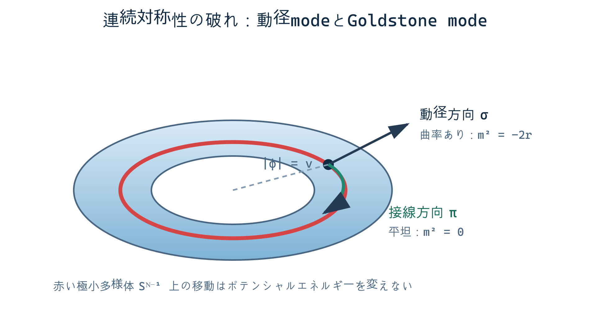

## 1. Isingからvector秩序変数へ

$N$成分実場 $\boldsymbol\phi=(\phi_1,\ldots,\phi_N)$ に対するLandau–Ginzburg作用を

$$
S[\boldsymbol\phi]=\int d^dx\left[
\frac12(\nabla\boldsymbol\phi)^2
+\frac r2\boldsymbol\phi^2
+\frac u{4!}(\boldsymbol\phi^2)^2
-\boldsymbol h\cdot\boldsymbol\phi
\right]
$$

とする。$\boldsymbol h=0$ では $\boldsymbol\phi\mapsto R\boldsymbol\phi$、$R\in O(N)$ の対称性をもつ。

- $N=1$: Ising 型の離散 $\mathbb Z_2$ 対称性。
- $N=2$: XY 型。秩序変数空間は円。
- $N=3$: Heisenberg 型。秩序変数空間は球面。

普遍性classを $N$ だけで決めるのは不十分で、空間次元、相互作用のrange、異方性、保存則、静的か動的かも指定する。本章は平衡・short-range・静的臨界現象を扱う。

## 2. 平均場の真空多様体

$\boldsymbol h=0$ の一様potential

$$
V(\boldsymbol\phi)=\frac r2\boldsymbol\phi^2
+\frac u{4!}(\boldsymbol\phi^2)^2,
\qquad u>0
$$

を最小化する。$r>0$ では $\boldsymbol\phi=0$。$r<0$ では

$$
|\boldsymbol\phi|^2=v^2=-\frac{6r}{u}
$$

で、最小点は $S^{N-1}$ をなす。一方向を選び

$$
\boldsymbol\phi=(\pi_1,\ldots,\pi_{N-1},v+\sigma)
$$

と展開する。potentialのHessianから

$$
m_\sigma^2=-2r,
\qquad
m_{\pi_a}^2=0
$$

を得る。$\sigma$ は振幅mode、$N-1$個の $\pi_a$ はGoldstone modeである。これは連続対称性が自発的に破れたと仮定した低エネルギー展開であり、有限体積では対称なGibbs状態が保たれうる。自発的対称性の破れは熱力学極限と外場ゼロ極限の順序を指定して定義する。

## 3. Goldstone揺らぎと赤外発散

長波長でGoldstone modeは概略

$$
S_{\rm G}=\frac{\rho_s}{2T}
\int d^dx\,(\nabla\boldsymbol\pi)^2
$$

に従う。局所秩序方向の揺らぎは

$$
\langle\pi^2\rangle
\sim T\int_{k_{\min}}^\Lambda
\frac{d^dk}{(2\pi)^d}\frac1{k^2}
\sim\int_{k_{\min}}^\Lambda dk\,k^{d-3}.
$$

$d<2$ ではpower、$d=2$ ではlogで赤外発散する。このpower countingは、有限温度・short-range・連続対称性系で通常の長距離秩序が不安定になることを示唆する。厳密な主張として [Mermin–Wagner (1966)](https://doi.org/10.1103/PhysRevLett.17.1133) が直接扱うのは、一次元・二次元の有限range isotropic Heisenberg模型における強磁性・反強磁性秩序の不在である。より一般の連続群・相互作用への拡張は、それぞれの定理の仮定を確認する。

この積分は定理の完全な証明ではない。仮定を可視化する赤外power countingである。長距離相互作用、明示的異方性、非平衡駆動、零温量子系では結論が変わりうる。

## 4. $N=1$ が例外である理由

Ising対称性は離散的なので連続的に回転するGoldstone modeがない。従って二次元short-range Isingが有限温度で秩序化してもMermin–Wagner定理と矛盾しない。

下部臨界次元は「どの対称性・相互作用で真の長距離秩序が可能か」に依存する。

- short-range Ising: $d_l=1$。$d=1$ の有限温度では無秩序、$d>1$ で秩序相が可能。
- short-range $O(N\ge2)$: 通常の強磁性的長距離秩序について $d_l=2$。

境界次元そのものでは、単純な「秩序あり／なし」以外の臨界相が現れうる。

## 5. 二次元XYとBKT機構

$N=2$ では $\boldsymbol n=(\cos\theta,\sin\theta)$ と書け、spin-wave近似は

$$
S=\frac K2\int d^2x\,(\nabla\theta)^2
$$

である。Gaussian揺らぎにより $\langle[\theta(x)-\theta(0)]^2\rangle$ は $\log|x|$ に比例し、

$$
\langle e^{i\theta(x)}e^{-i\theta(0)}\rangle
\sim |x|^{-\eta(T)}
$$

という準長距離秩序が生じる。磁化は熱力学極限でゼロでも相関長は無限である。

さらに位相 $\theta$ はcompactなのでvortexを許す。低温ではvortex–antivortexが束縛され、高温では解離する。Berezinskii–Kosterlitz–Thouless転移は通常のLandau型の局所秩序変数の期待値だけでは捉えにくく、stiffnessとtopological defectのfugacityを同時に流すRGを必要とする。

これは「Mermin–Wagnerにより二次元連続対称性系には相転移が一切ない」という誤読への反例である。禁止されるのは仮定内での通常の自発磁化であり、topological transitionや準長距離秩序ではない。[Kosterlitz–Thouless (1973)](https://doi.org/10.1088/0022-3719/6/7/010) はvortexを含むこの転移機構を定式化した。

## 6. 異方性とcrossover

結晶場は連続 $O(N)$ 対称性を離散部分群へ下げる摂動を導入する。例えばXY角度に対する $q$回異方性は

$$
\delta S=-g_q\int d^dx\,\cos(q\theta)
$$

と書ける。この演算子が対象固定点でrelevantなら、十分長い距離では別の普遍性classへcrossoverする。irrelevantなら臨界点近傍のleading exponentは $O(2)$ のままだが、ordered phaseでdangerously irrelevantとなる場合もある。

したがって実験・simulationで $O(N)$ 指数を見るためには、相関長が大きいだけでなく、異方性crossover長に対して観測scaleがどこにあるかを判断する必要がある。microscopic symmetryとemergent symmetryは同義ではない。

## 7. large-$N$という別の制御極限

$uN$ を固定して $N\to\infty$ とする展開は、$\epsilon=4-d$ と独立な制御法である。補助場で $\boldsymbol\phi^2$ 制約を扱うと、leading orderは自己無撞着なgap方程式に帰着する。$2<d<4$ では代表的に

$$
\eta=0+O(1/N),
\qquad
\nu=\frac1{d-2}+O(1/N)
$$

を得る。$N=\infty$ の結果を $N=1,2,3$ へ低次で代入するのは外挿であり、controlledなlarge-$N$ resultそのものではない。

## 8. 相互作用の range も普遍性クラスを決める

普遍性クラスは次元、秩序変数の成分数、対称性だけでは決まらない。相互作用が十分短距離なら、長波長二次作用の非解析でない部分は

$$
G^{-1}(k)=r+c k^2+O(k^4)
$$

となり、$k^2$ が leading の勾配項になる。一方、実空間で長距離tailをもつ相互作用では、Fourier空間に

$$
G^{-1}(k)=r+c_\sigma |k|^\sigma+c_2k^2+\cdots
$$

のような非解析核が現れることがある。$0<\sigma<2$ では $k\to0$ で $|k|^\sigma$ が $k^2$ より大きく、長距離核がGaussian scalingを支配する。場のcanonical dimensionも

$$
[\phi]=\frac{d-\sigma}{2}
$$

へ変わり、quartic couplingの上部臨界次元は $d_c=2\sigma$ になる **[Power-counting result for long-range kernels]**。

相互作用のrangeは、したがってtheory spaceで別の軸である。短距離固定点へcrossoverするか、長距離固定点に留まるかは、$\sigma$ と anomalous dimension を含む境界条件で判定される。流体のvan der Waals力やCoulomb力でも、screeningや保存量により有効rangeが変わるため、第16部 §8の適用条件として必ず確認する。

## 証拠水準

- vacuum manifoldとmass Hessian: 仮定したLandau potential内の **[Exact algebraic result / mean-field model]**。
- Goldstone赤外積分: **[Heuristic infrared power counting]**。
- Mermin–Wagner: 本文で限定した模型についての **[Rigorous theorem]**。
- BKTとlarge-$N$: それぞれtopological RGと $1/N$ による **[Controlled result in its stated regime]**。
- 長距離相互作用の $|k|^\sigma$ 分類: 長波長有効核に基づく **[Power-counting / crossover criterion]**。

## 章末整理

### この章で分かったこと

$O(N)$ 対称性の破れはGoldstone modeを生み、その赤外揺らぎが連続対称性系の下部臨界次元を決める。

### その結果、何が説明できるようになったか

Ising・XY・Heisenbergの違い、二次元での長距離秩序不在、BKT転移が共存する理由を区別できる。

### まだ説明できていないこと

BKT recursionの導出、$1/N$補正、異方性演算子のscaling dimensionは後の詳細課題である。

### よくある誤解

- Mermin–Wagner定理は二次元の全ての相転移を禁止しない。
- 有限体積で対称な期待値がゼロであることと、熱力学極限の自発的対称性破れは同じ主張ではない。
- microscopicな成分数だけで普遍性classは確定しない。

### 次に自然に出てくる疑問

$O(N)$ 成分のindex contractionを全て数えると、one-loop beta functionと臨界指数はどう $N$ に依存するか。

