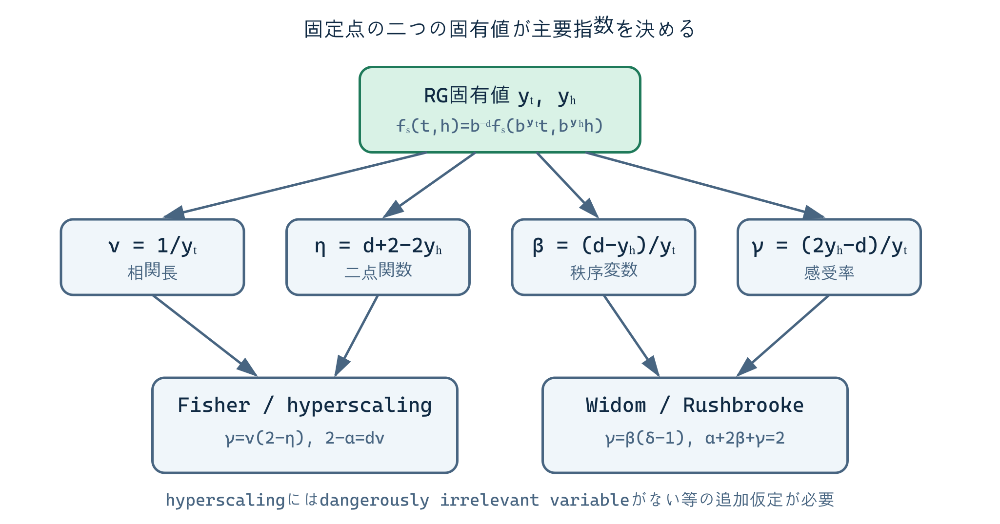

## 1. 指数の定義を揃える

還元温度を $t=(T-T_c)/T_c$、外場を $h$ とする。各臨界指数は、接近pathと相を指定して

$$
C_h(t,0)\sim A_\pm|t|^{-\alpha},
\qquad
m(t<0,0)\sim B(-t)^\beta,
$$

$$
\chi(t,0)\sim C_\pm|t|^{-\gamma},
\qquad
m(0,h)\sim D\,\operatorname{sgn}(h)|h|^{1/\delta},
$$

$$
\xi(t,0)\sim \xi_\pm|t|^{-\nu},
\qquad
G(r;0,0)\sim r^{-(d-2+\eta)}
$$

と定義する。$+$ と $-$ は $t>0$ と $t<0$ を表す。振幅 $A_\pm,C_\pm,\xi_\pm,B,D$ は一般に単位・規格化・microscopic detailへ依存するが、適切な振幅比には普遍量がある。

$\alpha=0$ だけでは比熱が有限か対数発散かを決めない。指数はleading powerを表し、対数補正とregular backgroundは別に記述する。

## 2. 自由エネルギーの斉次性

固定点近傍で温度型・磁場型の二つだけがrelevantで、hyperscalingが成立すると仮定する。特異自由エネルギー密度は

$$
f_s(t,h)=b^{-d}f_s(b^{y_t}t,b^{y_h}h)
$$

を満たす。ここで $t,h$ は一般には裸の温度・外場そのものではなく、解析的に混合したnonlinear scaling fieldである。

$b=|t|^{-1/y_t}$ と選べば

$$
f_s(t,h)=|t|^{d/y_t}
\Phi_\pm\!\left(h|t|^{-y_h/y_t}\right).
$$

一つのscaling function $\phi_\pm$ の微分が複数の観測量を生成することが、指数関係の起源である。

## 3. $\alpha,\beta,\gamma,\delta$ の導出

比熱の特異部は温度微分二回なので

$$
C_s\sim \frac{\partial^2 f_s}{\partial t^2}
\sim |t|^{d/y_t-2},
\qquad
\alpha=2-\frac d{y_t}.
$$

磁化 $m=-\partial f_s/\partial h$ は

$$
m(t,h)=|t|^{(d-y_h)/y_t}
M_\pm\!\left(h|t|^{-y_h/y_t}\right),
$$

従って

$$
\beta=\frac{d-y_h}{y_t}.
$$

さらに $h$ で微分して

$$
\chi(t,0)\sim |t|^{(d-2y_h)/y_t},
\qquad
\gamma=\frac{2y_h-d}{y_t}.
$$

臨界isothermでは $b=|h|^{-1/y_h}$ を選び

$$
m(0,h)\sim |h|^{(d-y_h)/y_h},
\qquad
\delta=\frac{y_h}{d-y_h}.
$$

これらは四つの指数が二つの固有値だけで決まることを示す。

## 4. 相関長と二点関数

相関長は長さなので

$$
\xi(t,h)=b\,\xi(b^{y_t}t,b^{y_h}h).
$$

$h=0$、$b=|t|^{-1/y_t}$ から

$$
\nu=\frac1{y_t}.
$$

場のscaling dimensionを $\Delta_\phi$ とすると、外場項 $\int d^dx\,h\phi$ が無次元であるため

$$
y_h=d-\Delta_\phi.
$$

臨界二点関数の定義 $2\Delta_\phi=d-2+\eta$ を用いて

$$
y_h=\frac{d+2-\eta}{2}
$$

を得る。

## 5. 四つの代表的関係

上の表式から代数的に

$$
\alpha+2\beta+\gamma=2
\qquad\text{(Rushbrooke equality)},
$$

$$
\gamma=\beta(\delta-1)
\qquad\text{(Widom)},
$$

$$
\gamma=\nu(2-\eta)
\qquad\text{(Fisher)},
$$

$$
2-\alpha=d\nu
\qquad\text{(Josephson/hyperscaling)}
$$

が従う。例えばRushbrooke関係は

$$
2-\frac d{y_t}
+2\frac{d-y_h}{y_t}
+\frac{2y_h-d}{y_t}=2
$$

と直接確かめられる。

文献では熱力学的安定性だけから得る不等式と、scaling仮説を加えた等式が同じ名称の近くで語られることがある。本章の等号は、上記の斉次性と微分可能性を仮定したscaling equalityである。

## 6. magnetic equation of state

磁化のscaling formで、$x=t/|h|^{y_t/y_h}$ を使う表現へ変えると

$$
m(t,h)=|h|^{(d-y_h)/y_h}
f_m\!\left(t|h|^{-y_t/y_h}\right).
$$

$1/\delta=(d-y_h)/y_h$ と $1/(\beta\delta)=y_t/y_h$ を用いれば

$$
m(t,h)=|h|^{1/\delta}
f_m\!\left(t|h|^{-1/(\beta\delta)}\right).
$$

逆に外場を磁化の関数として

$$
h=m^\delta f_h\!\left(t/m^{1/\beta}\right)
$$

と書ける。これは異なる温度・外場の実験曲線を一つのuniversal equation-of-state functionへcollapseさせる基礎である。ただしmetric factorを規格化しないscaling functionそのものは普遍ではない。

## 7. 振幅比が普遍になる理由

$t$ と $h$ の規格化を

$$
t\mapsto a_t t,\qquad h\mapsto a_h h
$$

と変えると個々の振幅は変わる。しかし同じmetric factorが相殺される組合せ、例えば $C_+/C_-$ や $\xi_+/\xi_-$、適切に無次元化した複数振幅の積は固定点と境界条件だけに依存しうる。

指数だけが普遍で振幅は全て非普遍、という二分法は粗すぎる。普遍情報にはscaling functionの規格化独立な形、振幅比、有限サイズの普遍量、operator product coefficientなども含まれる。

## 8. どこで破れるか

上部臨界次元より上では、quartic coupling $u$ がdangerously irrelevantである。Gaussian固定点の $y_t=2$ を単純hyperscalingへ代入すると $2-\alpha=d/2$ となるが、mean-fieldでは $\alpha=0$ であり $d>4$ と矛盾する。原因は

$$
f_s(t,h,u)=b^{-d}f_s(b^{y_t}t,b^{y_h}h,b^{y_u}u)
$$

で $u\to0$ の極限を正則と仮定できないことにある。

長距離相互作用、強い異方性、quenched disorder、複数の発散長、境界臨界現象でも仮定を再点検する。指数関係が数値的に破れたように見える場合、まずfinite-size correction、analytic background、crossover、接近pathを調べるべきである。

## 出典案内

scaling relations、hyperscaling、振幅比とその歴史的整理は [Fisher (1998)](https://doi.org/10.1103/RevModPhys.70.653) を参照する。本章の等号は自由エネルギーの斉次性を仮定した関係であり、熱力学的不等式だけから無条件に得たものではない。

## 証拠水準

- 指数関係: 二relevant field、斉次自由エネルギー、hyperscalingを仮定した **[Scaling identities under stated assumptions]**。
- magnetic equation of stateと振幅比: metric factorを分離した **[Universal scaling hypothesis]**。
- $d>4$ の破れ: dangerously irrelevant quartic couplingを保持する **[RG scaling result]**。

## 章末整理

### この章で分かったこと

自由エネルギーの二変数斉次性から主要な熱力学指数と四つのscaling relationを導ける。

### その結果、何が説明できるようになったか

指数が独立でない理由、equation of stateのdata collapse、振幅比の普遍性を同じ固定点構造で説明できる。

### まだ説明できていないこと

実際のuniversal scaling functionの高精度決定、複数scaling fieldが競合するmulticritical pointは未展開である。

### よくある誤解

- 全てのscaling relationは無条件の熱力学恒等式ではない。
- $\alpha=0$ だけでは対数発散か有限cuspかは決まらない。
- 個々の振幅は非普遍でも、振幅比には普遍量がある。

### 次に自然に出てくる疑問

量子場理論ではUV発散をcountertermで除いた後、同じ固定点とanomalous dimensionをどう取り出すか。

