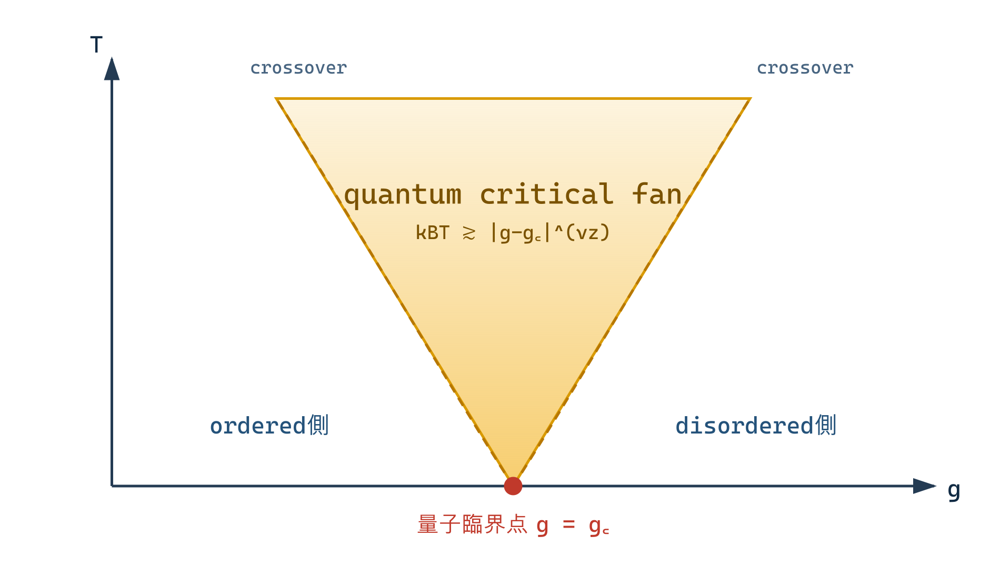

## 1. 量子相転移

Hamiltonian $H(g)$ のcoupling $g$ を零温度で変え、基底状態の性質が $g_c$ で非解析的に変わる現象を量子相転移という。熱揺らぎでなく、非可換項と不確定性が生む量子揺らぎがtransitionを駆動する。

$$
\xi\sim|g-g_c|^{-\nu}
$$

に加え、energy gapまたは相関時間は

$$
\Delta\sim\xi^{-z},
\qquad
\xi_\tau\sim\xi^z
$$

とscaleする。$z$ は空間と時間の異方性を表す。

## 2. path integralと虚時間

分配関数

$$
Z=\operatorname{Tr}e^{-\beta H}
$$

をTrotter分解すると、虚時間 $\tau\in[0,\beta)$ を加えたEuclidean path integralになる。bosonは周期、fermionは反周期境界条件をもつ。

零温度 $\beta\to\infty$ では虚時間方向も無限になる。$z=1$ でLorentz型対称性がemergentなら、$d$ 次元量子臨界点はしばしば $d+1$ 次元古典臨界点と同じscaling構造をもつ。

しかしBerry phase、dissipation、long-range temporal interaction、Fermi surface、gauge constraintがあると、単純な局所・等方的 $d+1$ 次元古典模型にはならない。

## 3. transverse-field Isingの例

$$
H=-J\sum_{\langle ij\rangle}\sigma_i^z\sigma_j^z
-h\sum_i\sigma_i^x
$$

では $J$ が $z$ 方向の秩序を、$h$ がspin flipによる量子揺らぎを促す。Trotter分解後、空間bondと虚時間bondをもつ異方的古典Ising模型へ写る。

連続極限で異方性を座標rescalingへ吸収できる臨界点では $z=1$ となる。従って一次元量子transverse-field Isingの臨界性は二次元古典Ising universalityと対応する **[Exact universality mapping in the Trotter/continuum limit]**。標準的導出は [Sachdev (2011)](https://doi.org/10.1017/CBO9780511973765) を参照する。

写像は有限Trotter stepでexactではなく、stepを0へ送る極限を含む。非普遍なcoupling対応と臨界点位置は別に計算する。

## 4. 有効次元と上部臨界次元

異方的scale変換

$$
x\mapsto bx,
\qquad
\tau\mapsto b^z\tau
$$

では時空measureが $b^{d+z}$ とscaleする。hyperscalingが成立する量子臨界点では、自由エネルギー密度の有効次元は $d+z$ になる。

局所 $\phi^4$ 理論なら、単純power countingで

$$
d+z=4
$$

が上部臨界次元の境界になることがある。ただしLandau dampingのような非解析的kernel、複数の $z$、dangerously irrelevant couplingがあると、この置換だけでは不十分である。

## 5. 有限温度という有限虚時間

有限温度では虚時間方向の長さが

$$
L_\tau=\frac{\hbar}{k_BT}
$$

に切られる。量子臨界scale $\xi_\tau\sim|g-g_c|^{-\nu z}$ と比較し

$$
k_BT\sim |g-g_c|^{\nu z}
$$

がcrossover境界を与える。

- $k_BT\ll |g-g_c|^{\nu z}$: 低温のordered側またはdisordered側。
- $k_BT\gg |g-g_c|^{\nu z}$: quantum critical fan。

fanは新しい零温度相ではなく、有限温度が臨界gapより大きく、$g_c$ fixed pointに支配されるcrossover領域である。

## 6. 有限温度scaling

energy scale $T$ は逆時間なのでRG固有値 $y_T=z$ をもつ。observable $O$ のscaling dimensionを $\Delta_O$ とすれば

$$
\langle O\rangle(r,T)
=b^{-\Delta_O}
\mathcal F_O(rb^{1/\nu},Tb^z).
$$

$b=T^{-1/z}$ と選び

$$
\langle O\rangle(r,T)
=T^{\Delta_O/z}
\Phi_O\left(r/T^{1/(\nu z)}\right).
$$

hyperscalingが成立すれば特異自由エネルギー密度は臨界couplingで

$$
f_s(0,T)\sim T^{(d+z)/z}.
$$

比熱などはこれを温度微分して得る。ただしFermi surfaceやdangerously irrelevant variableではhyperscaling violation exponentが必要になることがある。

## 7. Matsubara zero modeとclassical crossover

bosonic Matsubara周波数は

$$
\omega_n=2\pi nT.
$$

有限温度transitionへ十分近づくと、非零 $n$ modeはgap $\sim2\pi T$ をもち、$n=0$ modeが長距離を支配する。この領域では $d$ 次元古典universalityへdimensional reductionすることがある。

従って同じphase diagram内でも、零温度量子fixed pointが支配するfanと、有限温度classical fixed pointのasymptotic critical regionを区別する。実験の有効指数は両者のcrossoverを反映しうる。

## 8. Hertz型理論の注意

金属量子臨界ではfermionを積分して秩序変数だけの作用を作るHertz型手法がある。gapless Fermi surfaceを積分すると

- Landau damping。
- 非局所・非解析的vertex。
- 複数patch間のcoupling。

が生じうる。重いmassive場を消す通常EFTと違い、gapless自由度を安易に消すとlocal derivative expansionが破れる。

「有効次元 $d+z$ が4より上だからmean field」で全てを結論せず、fermion・gauge mode・dangerously irrelevant interactionがobservableへ戻るかを調べる。

## 9. RGが結ぶもの

量子臨界RGは、基底状態のentanglement、有限温度transport、spectral function、classical crossoverを同じfixed pointから整理する。ただしreal-time transportはEuclidean静的相関の解析接続を要し、保存則とhydrodynamicsも関与する。

標準的な枠組みは [Sachdev, *Quantum Phase Transitions*](https://doi.org/10.1017/CBO9780511973765)、秩序変数理論の原型は [Hertz (1976)](https://doi.org/10.1103/PhysRevB.14.1165) を参照する。$d+z$ hyperscalingとfanの式は **[Scaling hypothesis under single-scale assumptions]**、gapless fermionを消去したlocal actionの妥当性は **[Model-dependent approximation]** と区別する。

## 章末整理

### この章で分かったこと

量子臨界点では虚時間が追加scaleとなり、$\xi_\tau\sim\xi^z$ と有限温度長 $1/T$ の競合がphase diagramを組織する。

### その結果、何が説明できるようになったか

quantum-to-classical mapping、有効次元 $d+z$、quantum critical fan、有限温度classical crossoverを区別できる。

### まだ説明できていないこと

deconfined criticality、Fermi-surface patch RG、量子entanglementの普遍項は未展開である。

### よくある誤解

- 全ての $d$ 次元量子臨界点が等方的 $d+1$ 次元古典模型になるわけではない。
- quantum critical fanは独立した零温度相ではない。
- gapless自由度はmassive場と同じように常に局所EFTへ消去できない。

### 次に自然に出てくる疑問

固定点を持たないrunaway flow、first-order transition、複素固定点、turbulenceではRGをどう解釈するか。

