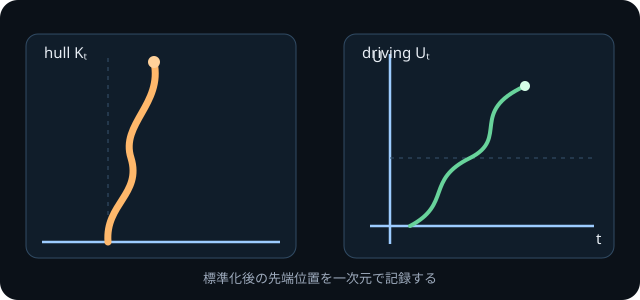

<!-- contract: authoring/contracts/00-production-fixture.json -->
<!-- synthetic-fixture: true -->

# この章で確かめること

この章は教材本文ではない。WebとPDFの双方で、数式、図、引用、相互参照、厳密な主張と直観の区別が壊れないことを検証する。読者は上半平面と複素平方根を知っているが、Loewner方程式はまだ知らないとする。

直接、成長曲線の全座標を保存しようとすると、時刻とともに状態が増え続け、過去を条件付けた後の法則を同じ状態空間で書けない。そこで生じる疑問は、**成長済み部分を消しながら、次の成長に必要な情報だけを残せないか**、である。

## 縦スリットを消す

時刻 $t\ge 0$ におけるhullを

$$
K_t=[0,2i\sqrt t]
$$

とする。$\mathbb H\setminus K_t$ を $\mathbb H$ へ戻す候補は

$$
g_t(z)=\sqrt{z^2+4t}
$$ {#eq-slit-map}

である。ただし平方根は、無限遠で $g_t(z)/z\to1$ となる枝を選ぶ。この条件がなければ符号が残り、写像を一意に定められない。

先端 $z=2i\sqrt t$ を @eq-slit-map に代入すると $g_t(z)=0$ であり、スリットの両側は実軸へ写る。さらに無限遠で二項展開すると、

$$
\begin{aligned}
g_t(z)
&=z\sqrt{1+\frac{4t}{z^2}}\\
&=z\left(1+\frac{2t}{z^2}-\frac{2t^2}{z^4}+O(|z|^{-6})\right)\\
&=z+\frac{2t}{z}-\frac{2t^2}{z^3}+O(|z|^{-5}).
\end{aligned}
$$ {#eq-hydrodynamic-expansion}

係数 $2t$ はEuclid長ではない。無限遠から見たhullの一次効果であり、本教材では $\operatorname{hcap}(K_t)=2t$ と規約を固定する。この量を時間に選ぶ理由は、小さなhullを順に消す合成で加法的になるからである [@lawler2005]。

{#fig-slit-map}

@fig-slit-map は曲線の変形を物理的運動として描いたものではない。同じ領域を標準座標で表し直す操作を左右に並べている。

## 時間微分からLoewner方程式へ

@eq-slit-map の両辺を二乗した

$$
g_t(z)^2=z^2+4t
$$

を、点 $z$ が飲み込まれる前に $t$ で微分する。連鎖律により

$$
2g_t(z)\,\partial_t g_t(z)=4,
$$

したがって

$$
\partial_t g_t(z)=\frac{2}{g_t(z)}
$$ {#eq-vertical-loewner}

を得る。スリットの根元を実軸上の $U_t$ へ移して同じ正規化を保つと、一般形

$$
\partial_t g_t(z)=\frac{2}{g_t(z)-U_t},
\qquad g_0(z)=z
$$ {#eq-chordal-loewner}

が現れる。ここで $U_t$ は実数である。成長先端のprime endが、標準領域 $\mathbb H$ の境界 $\mathbb R$ に写るからである。平面上の履歴全体を保持する代わりに、標準化後の先端位置を一本の実数値関数として記録できる。

::: {.content-visible when-format="html"}
{#fig-driving-trace}
:::

::: {.content-visible when-format="typst"}
{#fig-driving-trace-print}
:::

この同期図は「駆動関数が曲線の $x$ 座標である」と主張していない。$U_t$ は、成長済みhullを $g_t$ で消した後の標準座標における境界点である。

## 表示系が壊さない対象

長い式、行列、場合分けも同じ正本で確認する。例えばMöbius変換 $z\mapsto (az+b)/(cz+d)$ の係数は

$$
M=\begin{pmatrix}a&b\\c&d\end{pmatrix},
\qquad ad-bc>0,
$$

とまとめられる。また、監査上の対象は

$$
\operatorname{object}(t)=
\begin{cases}
\gamma[0,t],&\text{traceを問うとき},\\
K_t,&\text{filled hullを問うとき},\\
U|_{[0,t]},&\text{driving dataを問うとき}
\end{cases}
$$

のように区別する。狭い画面では長い式を本文幅の外へ押し出さず、式の領域だけを横スクロール可能にする。

::: {.callout-important title="STATUS: Proposition"}
適切な単純曲線を半平面容量でパラメータ付けし、hydrodynamic normalizationで過去を消すと、連続な実数値駆動関数を得る。ここでは縦スリットの場合を完全計算し、一般の場合の境界正則性は本章の検証対象外とする。
:::

::: {.callout-note title="幾何的な意味"}
曲線を単純化したのではない。毎時刻、過去を座標変換へ吸収し、未来に必要な境界データを一次元へ移した。この状態圧縮によってdomain Markov propertyを駆動関数の増分へ翻訳できる。
:::

## この検証で証明していないこと

::: {.callout-warning title="STATUS: Assumption boundary"}
Schrammの分類原理では、極限曲線族の等角不変性、domain Markov property、capacity時間で連続な駆動関数を仮定する。これらを「臨界だから当然」とは扱わない。
:::

Loewner ODEはまずhullを生成する。任意の連続駆動関数が良い曲線を生成するわけではなく、Brown運動を代入したときの連続traceの存在は独立した深い定理である [@rohdeSchramm2005]。

また、等角不変性とdomain Markov propertyを仮定した極限をSLEへ分類すること [@schramm2000] と、特定の格子模型についてその極限の存在と仮定を証明することは別である。このfixtureはpercolationのSLE$_6$収束を証明していない。

ここから自然に残る問いは、**等角不変性とdomain Markov propertyが、駆動関数の法則をどこまで決めるか**である。

## 検証用リンク

- [教材入口へ戻る](../index.qmd)
- [制作ガイドを開く](../authoring/README.md)
