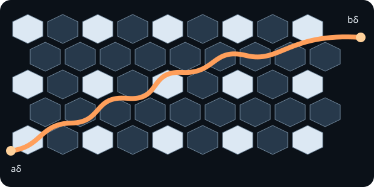

<!-- contract: authoring/contracts/01-lattice-to-interface.json -->

# 配置全体ではなく境界を見る

三角格子の各siteを確率 $1/2$ で白または黒に塗る。細かな配置全体を保存して格子幅 $\delta\to0$ を考えると自由度は増え続けるが、Dobrushin境界条件を課すと切替点 $a_\delta,b_\delta$ を結ぶ一本の経路が決まる。各stepで白を左、黒を右に見る辺を選ぶ。この局所規則で得る向き付き格子路を探索経路 $\gamma_\delta$ と呼ぶ。

{#fig-percolation}

::: {.callout-note title="STATUS: Definition"}
探索経路は白clusterと黒clusterを隔てる。向きを逆にすれば左右も交換される。
:::

曲線を連続写像 $\gamma_\delta:[0,1]\to\overline D$ として補間する。ただし格子stepの速さは本質でないため、向きを保つ再パラメータ化を同一視する。例えば
$$
d_{\mathrm{curve}}(\gamma,\eta)=\inf_\phi\sup_{0\le t\le1}|\gamma(t)-\eta(\phi(t))|
$$
で比較できる。これなら訪問順序を保ったまま描画速度を捨てられる。

配置全体より経路を選ぶ理由は、途中まで見た後も未探索領域で同じ規則が続く点にある。これがdomain Markov propertyの離散版になる。

::: {.callout-important title="STATUS: Proposition"}
有限格子では境界条件と白黒配置から探索経路が一意に決まる。ただし有限の一意性は $\delta\to0$ のtightnessや極限の一意性を含意しない。
:::

臨界値 $p=1/2$ では三角格子site percolationが色交換対称であり、後にSLE$_6$ 収束の入口になる [@smirnov2001]。しかし「臨界だから等角不変」とは置かない。等角不変性は離散observableを使って証明する出力である。

::: {.callout-warning title="STATUS: Limitation"}
本章で証明していないのはtightness、等角不変性、SLE$_6$ 同定である。定めたのは極限へ送る対象だけである。
:::

次に必要なのは、**曲線の何が、どの位相で収束するか**の指定である。

[次章](02-curve-space.qmd)
