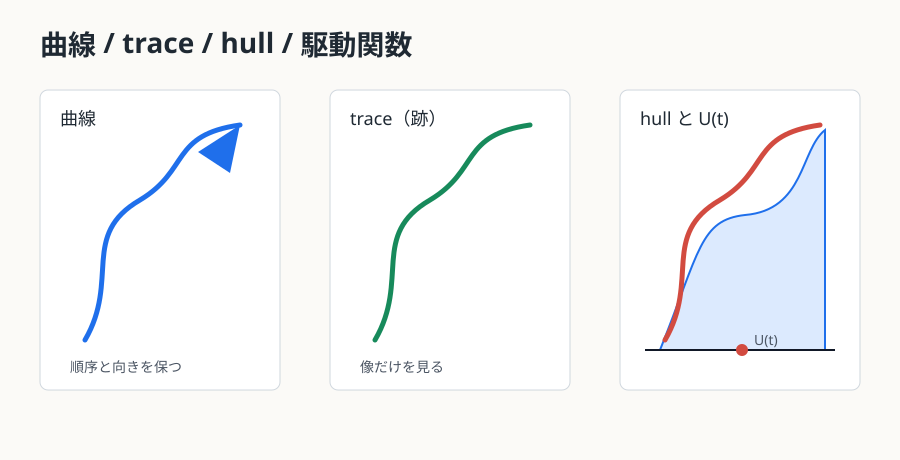

<!-- contract: authoring/contracts/02-curve-space.json -->

# 第2章 曲線空間を直接扱うことの破綻 {#ch-02}

> STATUS: この節の主張は、定理・引用定理・発見法・予想を区別して読む。
> STATUS: スケーリング極限や連続極限のうち本章で証明していない入力は、本文中で外部入力として扱う。

この章で使う前提は、曲線の収束を問うには「何を同一視し、何を記録するか」を決める必要がある、という点である。補助的な収束位相は付録Cで整理する。

## 曲線、trace（跡）、hull、駆動関数

曲線を扱う前に、対象を分ける。

| 対象 | 何を覚えるか | 何を忘れるか | 典型的な用途 |
|---|---|---|---|
| 曲線 curve | 時間付き写像 $\gamma(t)$、順序、向き | 再パラメータ化で速度は忘れることが多い | 格子経路の極限 |
| trace（跡） | 像 $\gamma[0,T]$ | 訪問順序と速度 | 幾何的形状 |
| hull（充填された成長集合） | trace と、先端から見えなくなった領域を埋めた集合 | 内部の巻き方の一部 | Loewner chain |
| 駆動関数 | 標準化後の先端の実数値 $U_t$ | 曲線への復元には条件が必要 | 分類と同定 |

{#fig-curve-trace-hull}

同じ trace でも、上から先に訪問する曲線と下から先に訪問する曲線は curve としては違う。逆に、trace がある点を通ることと hull がその点を飲み込むことも違う。たとえば曲線が実軸近くで大きな半円を描くと、半円の内側の点は trace には乗っていないが、先端から見えなくなるため hull には入る。

## 駆動関数の収束は曲線収束を自動で与えない

連続な駆動関数 $U_t$ から Loewner ODE を解くと hull $K_t$ は定まる。しかし、任意の連続 $U_t$ が一本の良い trace を生成するわけではない。駆動関数が非常に粗い場合、hull は成長しても、それが連続曲線の像として境界から伸びたものかどうかは別の問題になる。

このため、離散曲線の収束証明では次の橋が必要になる。

| 証明したいこと | 十分ではないもの | 追加で必要なもの |
|---|---|---|
| curve convergence | 駆動関数の有限次元分布収束 | tightness、crossing estimate、曲線回復 |
| hull convergence | trace の局所的近さ | Carathéodory 型の領域収束 |
| driving convergence | 曲線の見た目の近さ | 容量時間、標準化写像の制御 |
| 閉集合としての収束 | クラスターの集合収束 | 順序と向きの復元 |

読者がここで持つべき直観は、「曲線を実数関数へ圧縮する方法は強力だが、圧縮と復元は同じ難しさではない」ということである。

## 同じ trace でも同じ curve ではない

簡単な例を作る。半円弧の上半分と下半分をつないだ 8 の字型の像を考える。曲線 A は左の輪を回ってから右の輪へ行く。曲線 B は右の輪を回ってから左の輪へ行く。trace としての集合が同じでも、curve としては異なる。探索経路では、過去を消したあとの残り領域が違うため、この差は本質的である。

SLE で扱う chordal trace は自己交差の扱いに制約があるが、この例は情報の種類を分けるために役立つ。集合として同じでも、時間順序が違えば、条件付き未来の法則も、Loewner chain の標準化写像も変わる。

## 通ることと飲み込むこと

点 $z$ が trace 上にある、とは $\gamma(t)=z$ となる時刻があるという意味である。一方、点 $z$ が hull に飲み込まれる、とは $z$ が曲線の先端から見えない成分に入るという意味である。

上半平面で、曲線が実軸に近い大きな弧を描いて戻ってくる場面を想像する。弧の内側の点は曲線上にはない。しかし、その点から無限遠へ行く道は曲線と実軸で遮られるため、$\mathbb H\setminus K_t$ の無限遠成分には残らない。この点は trace に乗っていないが hull には入る。Loewner ODE の解でいえば、$g_t(z)$ が特異点に達して写像の対象領域から外れる。

この区別は $\kappa>4$ で特に重要になる。SLE trace は自己接触し、境界点や内部の領域を飲み込む。trace の幾何だけを見ていると、Loewner chain がどの点まで写像できるかを見落とす。

## 収束対象を選ぶための小さな実験

同じ離散経路から三つのデータを作る。第一は、格子頂点を通る順序付きの折れ線である。第二は、その折れ線の像だけを残した集合である。第三は、各時刻までに無限遠から見えなくなった部分を塗りつぶした集合である。第一は curve、第二は trace、第三は hull に対応する。

たとえば経路が細い袋小路を一周して元の場所へ戻るとする。curve は袋小路へ入った時刻と出た時刻を記録する。trace は一周した線だけを記録する。hull は袋小路の内側が先端から見えないなら、その内部も含める。この三つは、同じ離散データから作っても別の位相で収束し得る。

駆動関数についてはさらに注意がいる。容量時間で標準化すれば、各 hull は実数値の先端像 $U_t$ に符号化される。しかし、$U_t$ の一様収束だけから、元の曲線の一様収束を結論できない。小さな時間区間に激しく振動する駆動関数は、局所的には多くの細い枝を作り、hull の収束はあっても一本の trace の復元が不安定になることがある。

このため、収束証明では「どの対象を収束させるか」を先に宣言する。hull だけでよい問題なら Carathéodory 型収束を使う。曲線そのものが必要なら、交差確率、先端近傍の制御、再パラメータ化の tightness を追加する。証明の終盤で突然 curve convergence を要求すると、すでに証明した駆動過程の収束だけでは足りないことに気づく。

## 本章の到達点

本章で解決した問いは、曲線、trace（跡）、hull、駆動関数が同じ情報ではないことを明確にすることである。残った問いは、成長済みの hull をどう標準化して一変数の駆動関数へ読むかである。次章では、等角写像で過去を消す方法を導入する。

