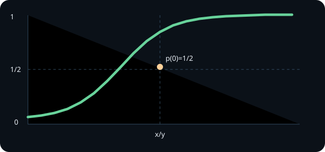

<!-- contract: authoring/contracts/10-left-passage.json -->

# 第10章 左側通過確率公式 {#ch-10}

> STATUS: この節の主張は、定理・引用定理・発見法・予想を区別して読む。
> STATUS: スケーリング極限や連続極限のうち本章で証明していない入力は、本文中で外部入力として扱う。

点 $z\in\mathbb H$ が SLE trace の左側に残る確率を求める。向きは 0 から $\infty$ へ進む曲線に沿って定める。左側通過確率公式は、Schramm の代表的な計算である [@schramm2001]。

スケーリング不変性により、確率は $z=x+iy$ の二変数ではなく $u=x/y$ の関数になる。$p(z)=F(x/y)$ と置き、第9章の生成作用素 $\mathcal L p=0$ を代入すると、常微分方程式が得られる。境界条件は、$u\to-\infty$ で確率 1、$u\to+\infty$ で確率 0 である。これは点が曲線のかなり左または右にある極限を表す。

$\kappa=4$ では式が特に簡単になり、読者は $F(u)$ の微分を直接代入して検算できる。ここで重要なのは、伊藤計算が目的ではなく、条件付き確率を Loewner 座標で保存量に変えるための道具だという点である。

{#fig-left-passage}

## 停止時刻と境界条件

左側通過確率を厳密に扱うには、点 $z$ が曲線に飲み込まれる時刻までで過程を止める。標準座標
$$
  Z_t=g_t(z)-U_t=X_t+iY_t
$$
を使うと、$Y_t\downarrow0$ へ近づくときに点が実軸側へ押し出され、左か右かが確定する。そこで、まず
$$
  \tau_{\varepsilon,R}
  =
  \inf\{t:Y_t\le\varepsilon\text{ or } |X_t/Y_t|\ge R\}
$$
で局所化し、境界値問題を有界な領域で解く。最後に $\varepsilon\downarrow0$、$R\uparrow\infty$ の極限を取る。この停止時刻を入れずに PDE だけを書くと、点が飲み込まれる境界と無限遠の境界条件を取り違えやすい。

## 左右の規約

左側通過確率を定義するには、曲線の向きを固定する必要がある。本教材では chordal SLE を 0 から $\infty$ へ向かう曲線として扱う。歩く人が曲線に沿って 0 から $\infty$ へ進むとき、左手側に点 $z$ が残る確率を左側通過確率と呼ぶ。

上半平面では、点が十分左、つまり $x/y\to-\infty$ の方向にあると、左側に残る確率は 1 に近づく。点が十分右、つまり $x/y\to+\infty$ の方向にあると、確率は 0 に近づく。この境界条件は図の向きと対応している。向きを逆にすれば左右も入れ替わる。

## $\kappa=4$ の検算

$\kappa=4$ では、左側通過確率は角度に対して線形な形になる。上半平面の点 $z=re^{i\theta}$ を考えると、候補は
$$
  p(z)=1-\frac{\theta}{\pi}
$$
である。これは負の実軸側で 1、正の実軸側で 0 になり、スケール $r$ に依存しない。

この特殊値は、読者が式を検算する入口として有用である。一般の $\kappa$ では超幾何関数が現れるが、まず $\kappa=4$ で「スケール不変性により角度だけの関数になる」「生成作用素が drift を消す条件を与える」「境界条件が定数を決める」という構造を確かめればよい。

一般の $\kappa$ で常微分方程式を立てるとき、独立な二変数をそのまま残す必要はない。Loewner 方程式は平行移動とスケーリングに対して共変であり、点 $z=x+iy$ は比 $u=x/y$ と角度の情報へ圧縮できる。境界条件は、曲線が点の左を通るという幾何的な意味を持つため、向きを反転した式と比較して符号を確認できる。

公式を使うときの実務上の注意は、確率の向き、SLE の始点と終点、上半平面の座標を毎回書くことである。同じ式でも、終点を無限遠から 0 へ移すと左右の解釈が変わる。左側通過確率公式は万能な確率表ではなく、規約付きの境界値問題の解である。

## 本章の到達点

本章で解決した問いは、左側通過確率を生成作用素、境界条件、停止時刻の三点から計算する方法である。残った問いは、こうした局所的な確率公式が曲線全体の次元や格子模型の収束証明とどう違うかである。次章では、SLE trace の Hausdorff 次元を外部定理として位置づける。

