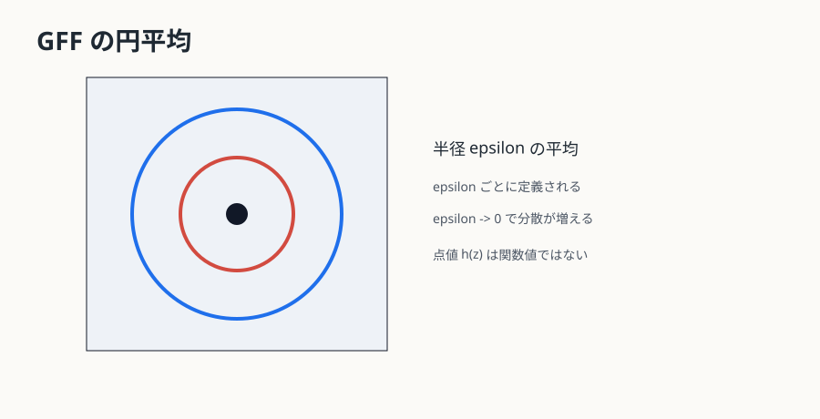

# 第16章 Gaussian Free Field は関数ではない {#ch-16}

この章の目的は、SLE$_4$ をランダム場の等高線として見る入口を作ることである。percolation や LERW の収束証明を置き換える章ではない。

GFF はランダム場であり、点ごとの値を持つ通常の関数ではない。滑らかな test function $\phi$ に対する平均 $(h,\phi)$ は定義できるが、$h(z)$ は定義できない。円平均 $h_\varepsilon(z)$ を取ると有限の量になるが、$\varepsilon\downarrow0$ で分散が発散する。

{#fig-gff-circle-average}

GFF を入れる理由は、SLE から話を広げるためではなく、一本の曲線からランダム場へ戻るためである。SLE$_4$ は GFF の level line と結びつく。点ごとの level set がない場から、条件付き平均と境界値問題を通じて曲線を復元する、というのが核心である。

## 円平均で見る GFF

GFF は点ごとの値を持たないが、円周上の平均
$$
  h_\epsilon(z)
$$
は意味を持つ。半径 $\epsilon$ を小さくすると、平均はより局所的な情報を拾うが、分散は大きくなる。これは、GFF が通常の関数ではなく分布であることの現れである。

この性質は、SLE との結合で大きな意味を持つ。level line と言っても、通常の関数の等高線のように $h(z)=c$ を点ごとに結ぶわけではない。境界条件、条件付き平均、local set という概念を使い、「曲線を見た後の場の条件付き法則」が再び GFF 型になることを利用して曲線を定義する。local set は「局所集合」と訳されることもあるが、本教材では GFF 文献での用語との対応を優先して local set と呼ぶ。

## 一本の曲線から場へ戻る

ここまでの本編は、二次元ランダム曲線を一次元 Brown 運動へ圧縮する話だった。GFF は逆向きの視点を与える。曲線は孤立した対象ではなく、背後にあるランダム場の境界線として現れることがある。

SLE$_4$ はその最も基本的な例である。percolation の SLE$_6$ や LERW の SLE$_2$ は、離散界面の極限として導入した。SLE$_4$ は、GFF という連続ランダム場の等高線として導入できる。これにより、SLE は「格子模型の境界」だけでなく、「ランダム場の幾何」ともつながる。

## GFF の共分散と局所性

平面 GFF の共分散は、形式的には Laplace 作用素の Green 関数である。二点が近いほど対数的に強く相関し、点ごとの分散が発散する。このため、GFF の議論では test function、円平均、または分布としての作用を使う。

SLE と結合するときは、曲線を見た後の場が「曲線の片側で条件付き平均を持つ GFF」と「残った揺らぎを持つ独立な GFF」に分かれるという構造が現れる。これは、曲線の過去を消して未来を標準領域へ戻す Loewner の考えと似ているが、対象は曲線から場へ変わっている。似ているという直観を、同じ定理だと読み替えてはいけない。

## 本章の到達点

本章で解決した問いは、GFF が点ごとの関数ではないにもかかわらず、円平均と条件付き平均を通じて SLE$_4$ の境界線と結びつく理由である。残った問いは、この結びつきをどの定理として借りるかである。次章では、SLE4-GFF 結合を外部定理として位置づける。

