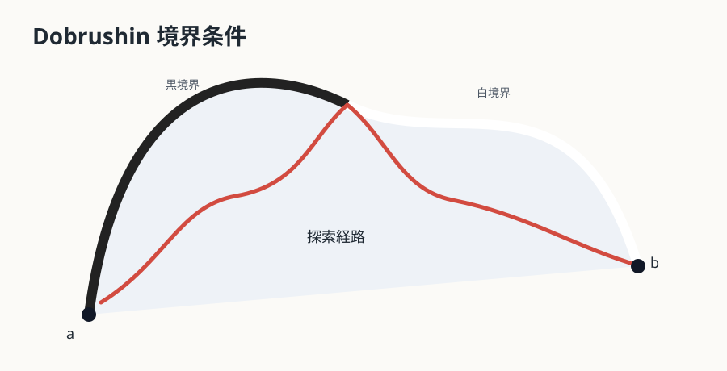
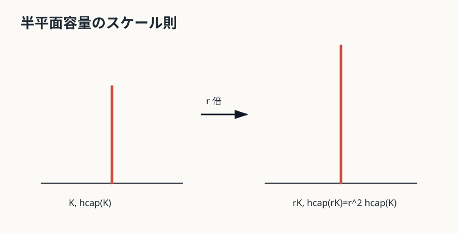
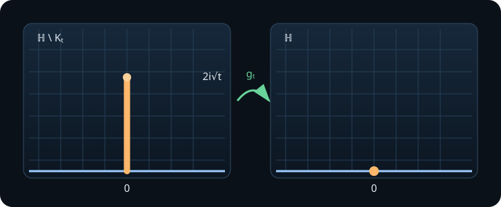
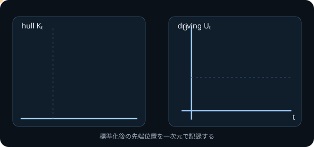
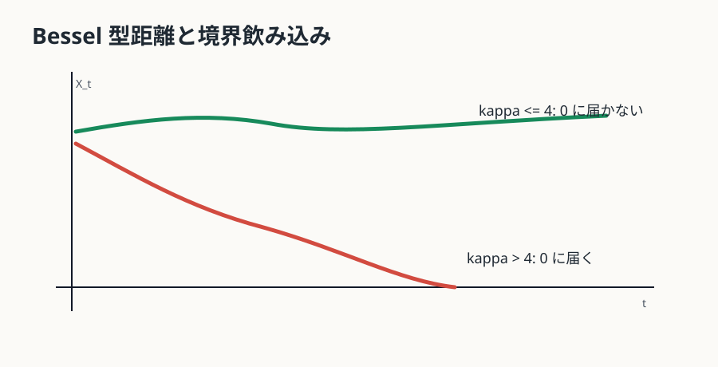
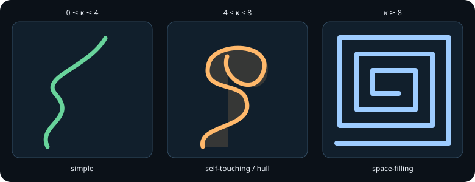
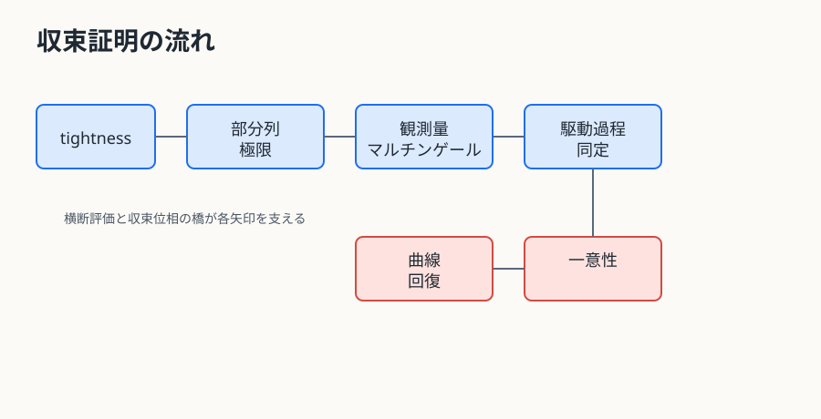
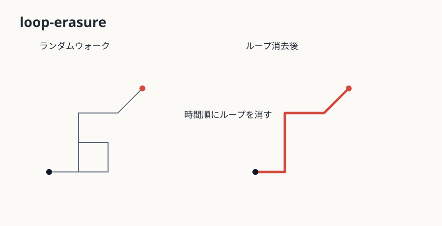

# この教材の問い {.unnumbered}

二次元の臨界模型には、白黒の塊、自己回避的な道、木の境界、スピンの界面など、複雑なランダム曲線が現れる。SLE は、それらの連続極限を「一本の実数値過程で駆動される等角写像の成長」として記述する理論である。

中心の問いは次である。

> なぜ、平面上の複雑なランダム曲線が、一次元の Brown 運動で記述されるのか。

答えは「臨界だから Brown 運動になる」ではない。曲線の過去を等角写像で消し、半平面容量で時間を測り、領域マルコフ性を標準領域で読み直すと、駆動関数は定常独立増分を持つ連続過程になる。さらにスケーリング則を課すと、drift は消え、残るのは
$$
  U_t=\sqrt{\kappa}B_t
$$
だけである。この分類原理と、特定の格子模型が本当にその極限へ収束することは別問題である。本教材はこの二つを分けて扱う。

::: {.callout-important title="判定の分離"}
この公開版は Quarto による HTML と、Quarto Typst による PDF を生成済みである。本文は Content Accepted Candidate として公開する。Complete 判定は、独立監査者による最終確認の後に分けて行う。
:::

[PDF版を開く](assets/sle-critical-phenomena.pdf)

# Part I 格子模型からランダム曲線へ {.unnumbered}

# 第1章 白黒の格子から一本の曲線へ {#ch-01}

この章で使う前提は、独立な白黒配置と境界条件だけである。確率論の詳しい道具はまだ使わない。

## なぜ塊全体ではなく界面を見るのか

臨界 percolation（パーコレーション）では、各格子点または各面を独立に黒か白へ塗る。三角格子 site percolation（サイト・パーコレーション）では、格子点の色を独立に決める。大きな黒い塊、白い塊、穴、細い首、分岐が同時に現れるため、塊全体をそのまま極限へ送ると、対象が大きすぎる。ここで Dobrushin 境界条件を入れる。単連結領域 $D$ の境界上に二点 $a,b$ を選び、境界弧 $ab$ の一方を黒、もう一方を白に固定する。すると、黒側と白側を分ける一本の探索経路が $a$ から $b$ へ走る。

{#fig-dobrushin}

この曲線はクラスターのすべてを覚えていない。しかし、境界条件の変化がどのように領域内部へ伝わるかを鋭く記録している。臨界点では大きなクラスターが多階層に現れるので、界面は格子幅を小さくしても消えず、曲がり続ける。したがって、極限を問う最小の対象として自然である。

探索経路の作り方も重要である。三角格子 site percolation を双対の六角格子で見ると、探索経路は黒い六角形を左、白い六角形を右に見ながら進む境界線である。各ステップでは、次に接する未探索のセルの色によって左へ曲がるか右へ曲がるかが決まる。つまり、曲線はクラスターの全体像をあとから輪郭抽出したものではなく、境界条件と局所的な色の情報を読みながら逐次的に生成される。

この逐次性が、後で領域マルコフ性につながる。すでに探索した部分は、いくつかのセルの色と新しい境界弧を露出させる。未探索領域の内部では、まだ見ていないセルの色は独立な臨界 percolation のままである。したがって「途中まで見た後の残りの探索経路」は、「小さくなった領域で同じ規則から始める探索経路」として記述できる。この事実は、SLE が突然現れる理由ではなく、後で駆動関数の独立増分へ翻訳される入力である。

ここでクラスターではなく界面を見るもう一つの理由がある。クラスターは分岐するが、Dobrushin 境界条件の探索経路は一本である。分岐する対象の極限では、どの枝をどの順序で読むかを別に決める必要がある。一本の界面を選ぶと、始点から終点へ向かう時間順序が最初から入る。Loewner 理論は「成長する一本の境界」を消しながら読む理論なので、この選択と相性がよい。

## スケーリング極限で何を固定するか

格子幅を $\delta$ とする。極限 $\delta\to0$ で固定するのは、物理的な領域 $D$、始点 $a$、終点 $b$、境界条件、臨界パラメータである。変わるのは、近似格子 $D^\delta$、離散探索経路 $\gamma^\delta$、そして曲線の細部である。

ここでの問いは、各時刻の点が収束するかではない。格子経路は細かく振動し、自然な速度も $\delta$ に依存する。より正しい問いは、再パラメータ化を許した曲線の法則が、あるランダム曲線の法則へ弱収束するかである。

この問いには、固定するものと忘れるものの区別が必要である。固定するのは、連続領域の形、境界点、境界条件、臨界点である。忘れるのは、格子の方位、各ステップの速度、微細なギザギザである。ただし、曲線の向きと順序は忘れない。探索経路は $a$ から $b$ へ進むので、ある点をいつ飲み込むか、過去を消した後に未来がどこから始まるかが意味を持つ。

たとえば単位円板で、境界上の二点を固定して格子幅を半分にする。曲線の本数は増えず、一本の曲線のステップ数だけが増える。期待する極限は「細かい折れ線の極限としての滑らかな曲線」ではない。むしろ、どの倍率で見ても同じ程度に揺らぐランダムな連続曲線である。このため、極限を測る物差しは長さではなく、曲線の法則そのものになる。

## 「臨界だから等角不変」とは言えない

臨界性は相関長が無限大になるという物理的直観を与える。スケールを変えても同じように見える、という期待も与える。しかし、スケール不変性は等角不変性より弱い。格子は局所的には六角形や正方形の向きを覚えており、すべての角度を保つ写像に対して分布が不変であることは、臨界性だけからは出ない。

三角格子 site percolation では Smirnov の定理により、Cardy 公式と等角不変な極限が証明される。これは特別な定理であり、「一般格子の percolation も同じ SLE$_6$ になる」という完全な普遍性は、同じ強さでは証明されていない。したがって、本教材では次の順に進む。

1. 極限曲線が等角不変性と領域マルコフ性を持つなら、なぜ SLE へ分類されるか。
2. percolation や LERW では、その仮定をどのように格子から証明するか。

この分離がないと、「SLE を定義したこと」と「格子模型が SLE へ収束すること」を混同してしまう。

## 探索経路を実際にどう読むか

探索経路は、完成したクラスターの境界をあとから描く操作ではない。未探索のセルに出会うたびに、現在の境界上で左側に黒、右側に白が来るように次の辺を選ぶ。この規則を固定すると、色配置から曲線への写像が決まる。二つの色配置が探索経路の最初の十ステップで同じ情報を与えるなら、その十ステップまでの曲線も同じになる。

この逐次生成を小さな例で確認する。始点から最初のセルを見たとき、黒なら左へ曲がり、白なら右へ曲がるとする。次に現れる未探索セルの色が黒、白、黒なら、曲線は「左、右、左」という三つの局所的な選択をする。ただし、曲がり方の確率を独立なコイン投げとみなしてよいわけではない。すでに露出した境界の形が次に見えるセルを決めるので、曲線の形には幾何学的な相関がある。独立なのは、まだ見ていないセルの色である。

この違いは、後の領域マルコフ性の原型である。探索を時刻 n まで進めた情報を $\mathcal F_n$ とする。未探索領域の各連結成分に対して、境界上の黒白の切り替え点を記録すれば、残りの色は条件付きでも元の積の測度を保つ。残りの探索経路は、その領域で同じ臨界模型を再開したものとして記述できる。

ただし、この離散的な性質から直ちに連続極限の領域マルコフ性が出るわけではない。格子幅を 0 に送るには、離散領域の形、境界点の近似、探索順序、曲線の再パラメータ化を同時に管理する必要がある。逐次生成規則は入力であって、極限定理そのものではない。

## 臨界点で何が変わるか

確率 p が臨界値から離れていると、典型的なクラスターの大きさには有限の相関長が現れる。格子幅を小さくしても、相関長を越えたスケールでは界面は局所的な揺らぎの集まりに見える。臨界点ではこの有限の長さが消え、単位領域の中に小さなクラスターから領域全体を横断するクラスターまで同時に現れる。

この多重スケール性が、界面を一つの連続曲線として見る理由である。曲線はどの倍率でも新しい折れ曲がりを持つため、通常の長さや接線で極限を記述することが難しい。一方、交差確率や境界イベントの確率は、曲線を細部まで追わずに測れる。後の Cardy 公式やマルチンゲールは、この曲線をイベントの確率で読む発想を発展させたものである。

臨界性が与えるのは、スケールをまたいだ構造が現れるという期待である。等角不変性、領域マルコフ性、そして曲線の一意な極限は別々の主張である。第1章の時点でこの三つを分離しておくと、SLE の分類と格子模型の収束証明を混同しないで済む。

## 本章の到達点

本章で解決した問いは、なぜ臨界模型から塊全体ではなく一本の探索経路を見るのか、である。残った問いは、その曲線の極限をどの対象として定式化するかである。次章では、曲線、跡、hull、駆動関数を分け、曲線空間だけで議論する危うさを確認する。

# 第2章 曲線空間を直接扱うことの破綻 {#ch-02}

この章で使う前提は、曲線の収束を問うには「何を同一視し、何を記録するか」を決める必要がある、という点である。補助的な収束位相は付録Cで整理する。

## 曲線、trace（跡）、hull、駆動関数

曲線を扱う前に、対象を分ける。

| 対象 | 何を覚えるか | 何を忘れるか | 典型的な用途 |
|---|---|---|---|
| 曲線 curve | 時間付き写像 $\gamma(t)$、順序、向き | 再パラメータ化で速度は忘れることが多い | 格子経路の極限 |
| trace（跡） | 像 $\gamma[0,T]$ | 訪問順序と速度 | 幾何的形状 |
| hull（充填された成長集合） | trace と、先端から見えなくなった領域を埋めた集合 | 内部の巻き方の一部 | Loewner chain |
| 駆動関数 | 標準化後の先端の実数値 $U_t$ | 曲線への復元には条件が必要 | 分類と同定 |

{#fig-curve-trace-hull}

同じ trace でも、上から先に訪問する曲線と下から先に訪問する曲線は curve としては違う。逆に、trace がある点を通ることと hull がその点を飲み込むことも違う。たとえば曲線が実軸近くで大きな半円を描くと、半円の内側の点は trace には乗っていないが、先端から見えなくなるため hull には入る。

## 駆動関数の収束は曲線収束を自動で与えない

連続な駆動関数 $U_t$ から Loewner ODE を解くと hull $K_t$ は定まる。しかし、任意の連続 $U_t$ が一本の良い trace を生成するわけではない。駆動関数が非常に粗い場合、hull は成長しても、それが連続曲線の像として境界から伸びたものかどうかは別の問題になる。

このため、離散曲線の収束証明では次の橋が必要になる。

| 証明したいこと | 十分ではないもの | 追加で必要なもの |
|---|---|---|
| curve convergence | 駆動関数の有限次元分布収束 | tightness、crossing estimate、曲線回復 |
| hull convergence | trace の局所的近さ | Carathéodory 型の領域収束 |
| driving convergence | 曲線の見た目の近さ | 容量時間、標準化写像の制御 |
| 閉集合としての収束 | クラスターの集合収束 | 順序と向きの復元 |

読者がここで持つべき直観は、「曲線を実数関数へ圧縮する方法は強力だが、圧縮と復元は同じ難しさではない」ということである。

## 同じ trace でも同じ curve ではない

簡単な例を作る。半円弧の上半分と下半分をつないだ 8 の字型の像を考える。曲線 A は左の輪を回ってから右の輪へ行く。曲線 B は右の輪を回ってから左の輪へ行く。trace としての集合が同じでも、curve としては異なる。探索経路では、過去を消したあとの残り領域が違うため、この差は本質的である。

SLE で扱う chordal trace は自己交差の扱いに制約があるが、この例は情報の種類を分けるために役立つ。集合として同じでも、時間順序が違えば、条件付き未来の法則も、Loewner chain の標準化写像も変わる。

## 通ることと飲み込むこと

点 $z$ が trace 上にある、とは $\gamma(t)=z$ となる時刻があるという意味である。一方、点 $z$ が hull に飲み込まれる、とは $z$ が曲線の先端から見えない成分に入るという意味である。

上半平面で、曲線が実軸に近い大きな弧を描いて戻ってくる場面を想像する。弧の内側の点は曲線上にはない。しかし、その点から無限遠へ行く道は曲線と実軸で遮られるため、$\mathbb H\setminus K_t$ の無限遠成分には残らない。この点は trace に乗っていないが hull には入る。Loewner ODE の解でいえば、$g_t(z)$ が特異点に達して写像の対象領域から外れる。

この区別は $\kappa>4$ で特に重要になる。SLE trace は自己接触し、境界点や内部の領域を飲み込む。trace の幾何だけを見ていると、Loewner chain がどの点まで写像できるかを見落とす。

## 収束対象を選ぶための小さな実験

同じ離散経路から三つのデータを作る。第一は、格子頂点を通る順序付きの折れ線である。第二は、その折れ線の像だけを残した集合である。第三は、各時刻までに無限遠から見えなくなった部分を塗りつぶした集合である。第一は curve、第二は trace、第三は hull に対応する。

たとえば経路が細い袋小路を一周して元の場所へ戻るとする。curve は袋小路へ入った時刻と出た時刻を記録する。trace は一周した線だけを記録する。hull は袋小路の内側が先端から見えないなら、その内部も含める。この三つは、同じ離散データから作っても別の位相で収束し得る。

駆動関数についてはさらに注意がいる。容量時間で標準化すれば、各 hull は実数値の先端像 $U_t$ に符号化される。しかし、$U_t$ の一様収束だけから、元の曲線の一様収束を結論できない。小さな時間区間に激しく振動する駆動関数は、局所的には多くの細い枝を作り、hull の収束はあっても一本の trace の復元が不安定になることがある。

このため、収束証明では「どの対象を収束させるか」を先に宣言する。hull だけでよい問題なら Carathéodory 型収束を使う。曲線そのものが必要なら、交差確率、先端近傍の制御、再パラメータ化の tightness を追加する。証明の終盤で突然 curve convergence を要求すると、すでに証明した駆動過程の収束だけでは足りないことに気づく。

## 本章の到達点

本章で解決した問いは、曲線、trace（跡）、hull、駆動関数が同じ情報ではないことを明確にすることである。残った問いは、成長済みの hull をどう標準化して一変数の駆動関数へ読むかである。次章では、等角写像で過去を消す方法を導入する。

# Part II Loewner 符号化と Schramm 分類 {.unnumbered}

# 第3章 等角写像で成長済み部分を消す {#ch-03}

この章で使う複素解析の前提は、上半平面、等角写像、無限遠展開である。Riemann 写像定理と Carathéodory 収束の補足は付録Cに置く。

## 過去を消す発想

探索経路 $\gamma[0,t]$ が伸びたあと、残りの未来は領域 $D\setminus \gamma[0,t]$ の中で進む。曲線空間を直接追うと、過去の形がどんどん複雑になる。そこで、成長済み部分を等角写像で消し、残り領域を標準領域へ戻す。

上半平面 $\mathbb H$ で考える。hull $K$ を取り除いた領域 $\mathbb H\setminus K$ が単連結なら、Riemann mapping theorem により $\mathbb H$ への等角写像が存在する [@ahlfors1979]。上半平面の自己同型は
$$
  z\mapsto \frac{az+b}{cz+d},\quad a,b,c,d\in\mathbb R,\ ad-bc>0
$$
であり、まだ三つの実自由度が残る。chordal setting では終点を $\infty$ に置き、無限遠で
$$
  g_K(z)=z+\frac{a(K)}{z}+O(|z|^{-2})
$$
となるように標準化する。この条件を hydrodynamic normalization と呼ぶ。本教材では $a(K)=2t$ と書き、$\operatorname{hcap}(K)=2t$ を半平面容量とする。

## 半平面容量は長さではない

半平面容量は hull の Euclid 長ではない。無限遠から見た「どれだけ上半平面を押しのけたか」を測る量であり、写像の無限遠展開の係数で定義される。縦に長い細い slit と横に広い低い hull は、見た目の長さが似ていても容量が違う。

スケーリング則は決定的である。$r>0$ とし、$rK=\{rz:z\in K\}$ とする。もし
$$
  g_K(z)=z+\frac{2t}{z}+O(|z|^{-2})
$$
なら
$$
  g_{rK}(z)=r\,g_K(z/r)
  =z+\frac{2r^2t}{z}+O(|z|^{-2}).
$$
したがって
$$
  \operatorname{hcap}(rK)=r^2\operatorname{hcap}(K).
$$

{#fig-hcap-scale}

時間を容量で測る理由はここにある。Brown 運動も $B_{r^2t}$ が $rB_t$ と同じ分布を持つ。曲線の空間スケールと駆動関数の時間スケールを合わせるには、容量時間が自然である。

## なぜ標準化がここまで必要なのか

Riemann mapping theorem は「どこかの等角写像が存在する」と言うだけである。存在だけでは、曲線の成長を一意の実数過程に変換できない。上半平面の自己同型が残っていると、同じ hull に対して異なる $g_K$ が選べてしまい、先端の像 $U_t$ も変わる。駆動関数を確率過程として議論するには、座標の自由度を先に消しておく必要がある。

chordal case では終点を $\infty$ に置くことで、自己同型は
$$
  z\mapsto az+b,\qquad a>0,\ b\in\mathbb R
$$
まで減る。さらに無限遠で $g_K(z)-z\to0$ とすることで $a=1$ を固定し、展開の定数項を 0 にすることで平行移動も固定する。残る最初の追加情報を含む係数が $1/z$ の係数であり、それを半平面容量として読む。

この標準化により、過去を消した後の領域はいつも同じ $\mathbb H$ に戻る。先端は実軸上の一点 $U_t$ になる。つまり、複雑な過去の形は $g_t$ に吸収され、未来へ渡す必要がある境界データは $U_t$ に圧縮される。

## Riemann 写像定理を使う順番

Riemann 写像定理を使うときは、三つの問いを順に分けるとよい。第一に、成長済み集合を除いた領域が単連結か。第二に、無限遠をどこへ送る写像を選ぶか。第三に、その写像を時間について比較できる標準化になっているか、である。

第一の問いは hull の定義に関係する。単なる trace を除くと、曲線が囲んだ領域が残って多重連結になることがある。そこで無限遠成分から見えない部分を hull に加え、補領域を単連結に保つ。これは便利な定義上の工夫ではなく、Riemann 写像定理を毎時刻適用するための条件である。

第二の問いでは、上半平面の自己同型群が現れる。終点を無限遠へ送ると、写像は $z\mapsto az+b$ の自由度を持つ。第三の hydrodynamic normalization はこの自由度を消し、無限遠から見た最初の変化を $1/z$ の係数に集める。標準化を先に済ませることで、異なる時刻の写像を同じ座標で比較できる。

## 容量時間を使った再パラメータ化

曲線の元の歩数は、格子模型ごとに意味が違う。percolation の一歩と LERW の一歩を同じ物理時間にする理由はない。そこで、連続極限の幾何に共通する半平面容量を時間として採用する。

容量時間では $\operatorname{hcap}(K_t)=2t$ が定義そのものになる。時間を変数変換してしまうと、Loewner 方程式の係数も変わる。SLE の分類で定常増分を使うためには、領域を標準化した後の増分が時間幅だけで比較できる必要があり、そのために容量時間が自然な選択になる。

## 半平面容量の手計算例

縦スリット $K_t=[0,2i\sqrt t]$ では
$$
  g_t(z)=\sqrt{z^2+4t}=z+\frac{2t}{z}+O(|z|^{-3})
$$
なので、$\operatorname{hcap}(K_t)=2t$ である。高さを $h$ と書くと $h=2\sqrt t$ だから
$$
  \operatorname{hcap}([0,ih])=\frac{h^2}{2}.
$$
長さ $h$ ではなく $h^2$ に比例する点に注意する。半平面容量は「長さ」ではなく、無限遠展開で見た二次元的な大きさである。

この計算は、後で Brown 運動が現れるための伏線でもある。空間スケールを $h$ 倍すると容量は $h^2$ 倍になる。Brown 運動の自然な時間スケールも空間スケールの二乗である。したがって、容量時間は確率論的分類と幾何学的標準化を同じ単位へ置く。

半円板を使った別の計算も、容量が長さでないことを示す。半径 r の小さな hull を上半平面の境界に貼り付けると、無限遠から見た摂動の一次の大きさは r ではなく r^2 になる。形状が半円でも長方形でも、十分遠くから見た最初の追加情報を含む係数は二次スケールで変わる。細部は係数に反映されるが、スケーリング次数は同じである。

この「二次である」という事実が、分類の確率論と幾何学を接続する。空間を r 倍すると容量時間は r^2 倍になる。一方、連続な定常独立増分過程がスケール不変なら、増分の分散も時間に比例し、空間の r 倍に対して r 倍になる。Brown 運動のスケーリング則と Loewner の容量則が、同じ時間の単位を指している。

## 本章の到達点

本章で解決した問いは、曲線の過去を等角写像で消し、半平面容量で時間を測る理由である。残った問いは、その標準化写像が時間とともにどの微分方程式を満たすかである。次章では、縦スリットを完全に計算して Loewner 方程式を導く。

# 第4章 縦スリットから Loewner 方程式へ {#ch-04}

## まず縦スリットだけを解く

いきなり
$$
  \partial_t g_t(z)=\frac{2}{g_t(z)-U_t}
$$
と書くと、Loewner 方程式は天下りの定義に見える。最初は、上半平面から縦スリット
$$
  K_t=[0,2i\sqrt t]
$$
を取り除く場合だけを計算する。

写像
$$
  g_t(z)=\sqrt{z^2+4t}
$$
を考える。平方根の枝は、無限遠で $g_t(z)\sim z$ となり、正の実軸を正の実軸へ送るように選ぶ。すると $g_t$ は $\mathbb H\setminus K_t$ を $\mathbb H$ へ写す。無限遠では
$$
  \sqrt{z^2+4t}
  =z\sqrt{1+\frac{4t}{z^2}}
  =z\left(1+\frac{2t}{z^2}+O(|z|^{-4})\right)
  =z+\frac{2t}{z}+O(|z|^{-3}).
$$
したがってこの slit の半平面容量は $2t$ であり、$t$ が容量時間である。

{#fig-vertical-slit}

両辺を時間で微分する。
$$
  g_t(z)^2=z^2+4t.
$$
したがって
$$
  2g_t(z)\,\partial_tg_t(z)=4,
  \qquad
  \partial_tg_t(z)=\frac{2}{g_t(z)}.
$$
これが Loewner 方程式の原型である。係数 2 は規約ではなく、半平面容量を $2t$ と測った結果として出ている。

この段階で得たのは、まだ一般の Loewner 方程式ではない。得たのは、原点から真上に伸びる縦スリットを容量時間で消す写像の微分方程式である。ここを飛ばすと、後で出てくる $g_t(z)-U_t$ の分母がただの記号に見えてしまう。分母は「標準化後の点 $g_t(z)$ と、標準化後の先端 $U_t$ の距離」である。

## 先端像が実数になる理由

縦スリットの先端 $2i\sqrt t$ は $g_t$ により 0 へ送られる。一般の単純曲線でも、$\mathbb H\setminus K_t$ の境界上の先端 prime end は、標準化写像 $g_t$ により実軸上の一点へ送られる。この実数を
$$
  U_t
$$
と呼び、駆動関数という。

曲線全体を追わず、各時刻に「過去を消したあとの先端が実軸上のどこにあるか」だけを追う。これが二次元曲線を一次元データへ変える核心である。

ただし、先端そのものが通常の境界点として扱えるとは限らない。曲線が境界に接したり、細い fjord を作ったりすると、幾何的な先端の近傍は複雑になる。そこで prime end という境界点の概念を使う。初読では、単純曲線なら「先端を境界点として写したもの」と読んでよい。重要なのは、標準化後には先端が実軸上の一点として記録される、という点である。

## 小時間増分から一般形へ

時刻 $t$ までの hull を消したあと、次の短い時間 $[t,t+\Delta t]$ に増える hull は、標準領域 $\mathbb H$ の実軸点 $U_t$ から生える小さな hull と見なせる。短時間では、その主項は縦スリットと同じ核を持つ。先端を $U_t$ から 0 へ平行移動して縦スリット近似を使い、戻すと
$$
  g_{t+\Delta t}(z)-g_t(z)
  \approx
  \frac{2\Delta t}{g_t(z)-U_t}.
$$
極限で
$$
  \partial_t g_t(z)=\frac{2}{g_t(z)-U_t},\qquad g_0(z)=z
$$
を得る。

もう少し丁寧に合成則を書く。時刻 $t$ までの写像を $g_t$、時刻 $t+\Delta t$ までの写像を $g_{t+\Delta t}$ とする。過去を消した標準領域で、短時間増分だけを消す写像を $\phi_{t,\Delta t}$ と書けば
$$
  g_{t+\Delta t}=\phi_{t,\Delta t}\circ g_t.
$$
増分 hull は $U_t$ から生える小さな hull なので、容量 $\Delta t$ の主項は
$$
  \phi_{t,\Delta t}(w)
  =
  w+\frac{2\Delta t}{w-U_t}+o(\Delta t)
$$
である。ここへ $w=g_t(z)$ を代入すると
$$
  g_{t+\Delta t}(z)
  =
  g_t(z)+\frac{2\Delta t}{g_t(z)-U_t}+o(\Delta t).
$$
$\Delta t$ で割って極限を取ると一般の chordal Loewner 方程式になる。

この導出で近似の誤差を管理するには、増分 hull の容量を $\Delta t$ に固定し、無限遠展開の $1/w$ 係数だけを比較する。局所的な形が縦スリットと異なっていても、容量が同じなら一次の主項は $2\Delta t/(w-U_t)$ である。形状依存の情報は $o(\Delta t)$ に入り、極限方程式の主項から消える。

また、先端を $U_t$ から 0 へ動かしてから縦スリット近似を使う順番が重要である。平行移動を省くと、分母は $g_t(z)$ と書かれてしまい、現在の先端位置を忘れてしまう。標準化写像の合成は「過去を消す写像」と「新しい増分を消す写像」の順序付き積であり、この合成が時間発展の情報を持つ。

ただし、この形式的な極限は hull を生成する方程式の導出である。連続な駆動関数から実際に連続 trace が存在することは、別の解析定理である。したがって、第4章では「Loewner equation がなぜこの形か」と「その方程式がどのような曲線を生成するか」を明確に分ける。

この議論で厳密化が必要な点は、短時間増分 hull が本当に縦スリットと同じ主項を持つこと、容量が加法的な時間として働くこと、そして曲線の境界正則性である。本教材ではその技術部を分離し、読者が式の出どころを追えることを優先する。

ここで ODE がまず生成するのは curve ではなく hull $K_t$ である。点 $z$ について、解が実軸上の特異点 $U_t$ にぶつかる時刻を $\tau_z$ とし、
$$
  K_t=\{z\in\overline{\mathbb H}:\tau_z\le t\}
$$
と定める。trace の存在は追加の定理であり、定義に含めてはいけない。

{#fig-driving-trace}

## 本章の到達点

本章で解決した問いは、縦スリット写像の計算から chordal Loewner 方程式がどう出るかである。残った問いは、ランダムな臨界曲線では駆動関数 $U_t$ がどの確率過程になるかである。次章では、領域マルコフ性とスケーリングから Brown 運動を強制する分類原理を見る。

# 第5章 Schramm の分類原理 {#ch-05}

この章で使う確率論の前提は、条件付き法則、独立増分、定常増分、Brown 運動である。連続なレヴィ過程（Lévy process）の分類は付録Aで補う。

## 領域マルコフ性を標準領域で読む

離散探索経路には自然な領域マルコフ性がある。途中まで探索したとき、まだ見ていない領域の色は、露出した境界条件を条件にして、同じ模型の新しい標本である。連続極限でこれに対応する性質は次である。

時刻 $t$ までの曲線を知り、過去の hull を取り除く。残り領域を $g_t$ で $\mathbb H$ へ戻し、さらに $U_t$ を 0 へ送る平行移動をする。この標準化後の未来曲線の法則が、元の曲線の法則と同じで、かつ過去と独立である。これを連続の領域マルコフ性という。

ここで重要なのは、単に「未来が同じ模型」というだけではない。容量時間で測り、hydrodynamic normalization を選び、先端を 0 へ戻した後で同じ法則へ戻る、という標準化を含む。

## 独立増分と定常増分

標準化後の未来の駆動関数を $U^{(t)}_s$ と書く。合成則から、それは
$$
  U^{(t)}_s=U_{t+s}-U_t
$$
に対応する。領域マルコフ性により、この未来の法則は過去から独立である。したがって $U_{t+s}-U_t$ は過去 $\mathcal F_t$ と独立である。

さらに、標準化後の未来の法則は元の法則と同じなので、$U_{t+s}-U_t$ の分布は $U_s-U_0$ と同じである。これが定常増分である。まとめると、駆動関数 $U_t$ は連続で、独立増分と定常増分を持つ。

確率論の基本定理により、連続な定常独立増分過程は
$$
  U_t=bt+\sigma B_t
$$
の形である。ここで $B_t$ は標準 Brown 運動、$b$ は drift、$\sigma\ge0$ である。

## スケーリングが drift を消す

半平面容量のスケーリング則は、空間を $r$ 倍すると時間が $r^2$ 倍になることを示した。等角不変性とスケーリング不変性から、標準化された駆動関数は
$$
  (r^{-1}U_{r^2t})_{t\ge0}
$$
と同じ法則を持たなければならない。

もし $U_t=bt+\sigma B_t$ なら
$$
  r^{-1}U_{r^2t}
  =r^{-1}br^2t+r^{-1}\sigma B_{r^2t}
  =brt+\sigma \widetilde B_t.
$$
これがすべての $r>0$ で $bt+\sigma B_t$ と同じ法則を持つには、$b=br$ がすべての $r$ で必要であり、したがって $b=0$ である。左右対称な模型では、反射 $x\mapsto -x$ により drift が符号を変えるため、同じ結論をより直接に得る。

drift をより明示的に見る。容量時間では、空間を $\lambda$ 倍すると時間は $\lambda^2$ 倍になる。drift 付き候補
$$
  U_t=at+\sqrt{\kappa}B_t
$$
をスケーリングすると
$$
  \lambda^{-1}U_{\lambda^2t}
  =
  \lambda a t+\sqrt{\kappa}\,\widetilde B_t.
$$
元の法則と同じであるには、drift 係数が $a$ と $\lambda a$ の両方でなければならない。すべての $\lambda>0$ でこれは $a=0$ のときだけ可能である。したがって Brown 運動成分はスケーリングで保たれるが、線形 drift は保たれない。

残るのは
$$
  U_t=\sqrt{\kappa}B_t,\qquad \kappa=\sigma^2\ge0.
$$
これが Schramm の分類原理である [@schramm2000; @schramm2006]。

::: {.callout-note title="分類と収束は別である"}
この章が示したのは、極限曲線が等角不変性、領域マルコフ性、容量時間で連続な駆動関数を持つなら、その極限は SLE$_\kappa$ である、という分類である。percolation や LERW の離散曲線が実際にその仮定を満たす極限へ収束することは、第12〜14章の別問題である。
:::

## 離散の領域マルコフ性と連続の領域マルコフ性の違い

離散 percolation の領域マルコフ性は、未探索セルの独立性から直接出る。すでに見たセルの色を条件にすると、見ていないセルは同じ $p=1/2$ の独立な色である。これは格子上の事実であり、等角写像はまだ出てこない。

連続の領域マルコフ性は、これを極限曲線の言葉へ移したものである。途中までの hull を取り除くと領域が変わる。そのままでは、未来の法則は毎回違う領域上の曲線法則である。等角不変性を使ってその領域を標準領域へ戻し、さらに先端を 0 に戻すことで、初めて「同じ法則が再び始まる」と言える。

したがって、独立増分は領域マルコフ性だけから出るのではない。必要なのは、次の四つの組み合わせである。

1. 過去を hull として消す。
2. hydrodynamic normalization で標準写像を一意にする。
3. 容量時間で未来の時間を測る。
4. 先端 $U_t$ を 0 へ平行移動し、等角不変性で元の法則と同一視する。

この四つを通すと、未来の駆動関数が $U_{t+s}-U_t$ として現れ、過去と独立で、分布も時刻 $t$ に依存しないことがわかる。

## 連続なレヴィ過程から Brown 運動へ

確率論の定理として、連続な定常独立増分過程、すなわち連続なレヴィ過程は drift 付き Brown 運動である。ここでは定理の完全証明はしないが、なぜ他の候補が消えるかを説明する。

独立増分を持つ過程には Poisson 過程のようなジャンプ過程もある。しかし駆動関数にジャンプがあると、Loewner chain の先端像が実軸上で不連続に飛ぶ。曲線の極限を連続な界面として扱う本教材の仮定とは合わない。したがってジャンプ成分は除かれる。

残る連続なノイズで、定常独立増分を持ち、分散が時間に比例するものが Brown 運動である。drift $bt$ は決定論的な偏りであり、左右対称性またはスケーリングで消える。分散係数 $\sigma^2$ だけは残る。この残った一つの非負パラメータを
$$
  \kappa=\sigma^2
$$
と呼ぶ。

$\kappa$ は単なる記号ではない。駆動関数の揺れの強さであり、曲線の幾何を変える量である。小さい $\kappa$ では先端は比較的まっすぐ進み、大きい $\kappa$ では実軸上を激しく揺れ、曲線は自己接触や飲み込みを起こす。第7章以降で見る幾何相は、この一つの係数から出る。

## 増分の計算を一度書き下す

時刻 $t$ までの過去を固定し、標準化した未来の駆動を $V_s^{(t)}$ とする。領域マルコフ性は、条件付きで
$$
  (V_s^{(t)})_{s\ge0}\overset{d}= (U_{t+s}-U_t)_{s\ge0}
$$
であり、右辺の法則が過去の情報に依存しないことを意味する。従って、任意の $0=t_0<t_1<\cdots<t_n$ に対して、増分
$$
  U_{t_1}-U_{t_0},\quad U_{t_2}-U_{t_1},\quad\ldots,\quad U_{t_n}-U_{t_{n-1}}
$$
は独立になる。時刻をずらしても同じ長さの増分の法則が同じなので、定常増分も得られる。

ここで等角不変性は、領域マルコフ性を標準半平面の同じ問題へ戻す役割を果たす。等角不変性がなければ、残り領域の形状が未来の駆動法則に残り、$U_{t+s}-U_t$ の法則は t に依存してしまう。したがって「DMP だから Brown 運動」という言い方は短すぎる。DMP は、標準化と等角不変性を通した後に、独立定常増分へ翻訳される。

## 分類原理の論理範囲

分類原理の仮定を並べると、次の五段階になる。第一に、極限が一本の成長対象として定義できる。第二に、過去を hull として消した後の未来が領域マルコフ性を持つ。第三に、等角写像で標準領域へ戻した法則が元の法則と一致する。第四に、容量時間で駆動関数が連続になる。第五に、模型の左右対称性またはスケーリング不変性がある。

この五段階から SLE が分類されるが、格子模型のどの observable がこの仮定を証明するかは模型ごとに異なる。percolation では交差確率と離散正則性、LERW では Green 関数とランダムウォークの領域マルコフ性が中心になる。したがって分類原理は、各模型の収束証明を置き換える定理ではなく、極限を同定する最後の枠組みである。

## 本章の到達点

本章で解決した問いは、等角不変性と領域マルコフ性を Loewner 記述へ移すと、なぜ駆動関数が Brown 運動に限られるかである。残った問いは、Brown 駆動の Loewner chain が本当に曲線を生成し、その曲線の幾何が $\kappa$ でどう変わるかである。次章では、まず hull-first の定義と trace 存在定理を分ける。

# Part III SLE の幾何と計算 {.unnumbered}

# 第6章 Brown 運動を入れた Loewner chain {#ch-06}

SLE$_\kappa$ は、駆動関数を $U_t=\sqrt{\kappa}B_t$ とした chordal Loewner chain である。Brown 運動は連続だが、どの区間でも有界変動ではなく、非常に粗い。そのため、ODE の解として hull $K_t$ は定義できても、それが連続 trace $\gamma(t)$ で生成されることは本文だけでは直ちには従わない。

外部定理として Rohde-Schramm trace theorem を使う [@rohdeSchramm2005]。

| 項目 | 内容 |
|---|---|
| 入力 | Brown 運動による駆動 $U_t=\sqrt{\kappa}B_t$ |
| 出力 | ほとんど確実に連続 trace が存在し、hull はその trace から生成される |
| 難所 | 粗い駆動関数、境界近くの歪み、飲み込みの制御 |
| 本教材で証明しない部分 | trace 存在の完全証明 |
| 下流で使う場所 | 幾何相、通過確率、離散曲線との比較 |

$\kappa=0$ では $U_t=0$ であり、第4章の縦スリットが戻る。したがって、SLE は縦スリットの決定論的成長を、Brown 運動で揺らした族と見ることができる。ただし、定義の順序は hull-first である。曲線を先に仮定しないことが、粗い駆動にも対応できる理由である。

本章で借りる外部定理は、Brown 駆動を入力し、ほとんど確実な連続 trace の存在を出力する。任意の連続駆動関数に対して同じ結論を主張するものではない。

## Brown 駆動の粗さはどこに効くか

Loewner ODE は、各固定点 $z\in\mathbb H$ について
$$
  \partial_t g_t(z)=\frac{2}{g_t(z)-U_t}
$$
を解く式である。$U_t$ が連続なら、解は爆発時刻までは通常の ODE として存在する。したがって hull $K_t$ は定義できる。しかし、これはまだ「境界から一本の線が伸びている」と言っていない。

滑らかな駆動関数なら、先端はよく制御され、hull は曲線で生成されると期待しやすい。Brown 運動は連続だが、どこを拡大しても激しく揺れる。駆動関数が短時間に何度も左右へ揺れると、対応する hull は境界近くで細かい入り江を作る。これが trace 存在定理の難しさである。

読者が混同しやすい点を分ける。

| 主張 | 難しさ |
|---|---|
| ODE 解が各点に対して存在する | 通常の ODE と爆発時刻の議論 |
| hull $K_t$ が増大する | 解が飲み込まれる点の集合として定義する |
| hull が連続曲線で生成される | Brown 駆動の粗さと境界歪曲を制御する深い定理 |
| trace の法則が格子曲線の極限である | さらに離散模型ごとの収束証明が必要 |

この章で SLE を定義するとき、最後の二つを定義の中へ入れない。定義は hull-first、trace は外部定理、格子模型との関係はさらに後の定理である。

## hull-first で定義する意味

駆動関数が連続なら、各点 z に対する ODE の最大解と爆発時刻を調べられる。ここで解が存在しなくなった点を集めると増大 hull が得られる。先端が一本の曲線として存在するかを先に仮定しないので、自己接触や領域の飲み込みを含む粗い成長も同じ定義で扱える。

trace theorem の仕事は、この hull-first の対象に対して「ほとんど確実に連続な trace があり、しかもその trace が hull を生成する」と戻すことである。入力は駆動の確率過程、出力は境界の幾何であり、両者を同一視するために境界歪曲の評価が必要になる。

数値実験では、逆 flow で点を動かすと曲線が簡単に描ける。しかし、数値的に描けた一本の線は、ODE が生成した hull の一例にすぎない。曲線の存在、法則の一意性、格子極限との一致はそれぞれ別の検証項目として残る。

## 逆 Loewner の直観

数値実験で SLE の絵を描くときは、しばしば逆 Loewner flow を使う。forward Loewner は成長済み hull を消す向きであり、点を標準領域へ押し戻す。逆 Loewner は、標準領域側から小さな slit を継ぎ足していく向きである。

この直観は有用だが、証明の向きと混同してはいけない。分類原理で使うのは、過去を消した後の未来法則であり、forward Loewner の標準化である。逆 flow の絵は「駆動関数が曲線を作る」ことを可視化するが、「任意の駆動関数が良い曲線を作る」ことの証明ではない。

## 本章の到達点

本章で解決した問いは、SLE をまず hull の成長として定義し、trace の存在を外部定理として切り分ける理由である。残った問いは、$\kappa$ が実際に境界との接触や飲み込みをどう変えるかである。次章では、実軸上の点を追跡して Bessel 過程へ帰着する。

# 第7章 実軸点を追うと Bessel 過程が現れる {#ch-07}

実軸上の点 $x>0$ を追う。標準座標で先端から見た距離を
$$
  X_t=g_t(x)-U_t
$$
とする。これは元の平面での Euclid 距離ではなく、過去の hull を消した後の標準座標での距離である。

Loewner 方程式と $dU_t=\sqrt{\kappa}\,dB_t$ から
$$
  dX_t=\frac{2}{X_t}\,dt-\sqrt{\kappa}\,dB_t.
$$
$Y_t=X_t/\sqrt{\kappa}$ とおくと、$dY_t=(1/\sqrt{\kappa})dX_t$ である。Brown 運動の符号は分布を変えないので、$\widetilde B_t=-B_t$ と書けば
$$
  dY_t=d\widetilde B_t+\frac{2/\kappa}{Y_t}\,dt.
$$
Bessel 過程の標準形
$$
  dR_t=dB_t+\frac{\delta-1}{2R_t}\,dt
$$
と比べると、次元は
$$
  \delta=1+\frac4\kappa
$$
である。

係数比較を一段だけ書くと、Bessel 過程では drift 係数が $(\delta-1)/(2R_t)$ である。ここで $R_t=Y_t$ と見れば
$$
  \frac{\delta-1}{2}=\frac{2}{\kappa}
  \quad\Longrightarrow\quad
  \delta=1+\frac4\kappa.
$$
したがって、$\kappa$ が大きいほど Bessel 次元は小さくなり、0 に到達しやすくなる。

Bessel 過程は、$\delta\ge2$ なら 0 に到達せず、$\delta<2$ なら 0 に到達する。したがって
$$
  1+\frac4\kappa \ge 2
  \quad\Longleftrightarrow\quad
  \kappa\le4
$$
が境界点を飲み込まない側であり、$\kappa>4$ では実軸点が飲み込まれる。

停止時刻 $\tau_{\varepsilon,R}=\inf\{t:X_t\le\varepsilon\text{ or }X_t\ge R\}$ を入れるのは、0 と無限遠で係数が特異になるためである。局所化した区間で生成作用素の境界値問題を解き、$\varepsilon\downarrow0$、$R\uparrow\infty$ を取る。これが $\kappa=4$ を境界飲み込みの閾値にする計算の骨格である。

{#fig-bessel}

## $X_t$ は元の距離ではない

$X_t=g_t(x)-U_t$ は、元の上半平面で先端と $x$ の距離を測っているのではない。過去の hull を消し、標準化写像 $g_t$ で残り領域を $\mathbb H$ へ戻したあと、先端像 $U_t$ から実軸点 $g_t(x)$ までの距離を測っている。

この違いは重要である。元の平面では、曲線が点 $x$ に近づいたように見えても、細い通路が残っていればまだ飲み込まれていない。標準座標では、その通路の細さや歪みが $g_t$ に反映される。$X_t$ が 0 に近づくことは、標準領域から見て点 $x$ が先端に吸い寄せられ、最終的に飲み込まれることを表す。

## 生成作用素と境界値問題

到達確率を計算するとき、関数
$$
  f(x)=\mathbb P_x(X_t \text{ が } R \text{ より前に } \varepsilon \text{ へ到達する})
$$
を考える。局所化した区間 $(\varepsilon,R)$ では、$X_t$ の生成作用素は
$$
  \mathcal A f(x)=\frac{\kappa}{2}f''(x)+\frac{2}{x}f'(x)
$$
である。到達確率は
$$
  \mathcal A f=0,\qquad f(\varepsilon)=1,\quad f(R)=0
$$
を満たす。解の形は $1$ と $x^{1-4/\kappa}$ の組み合わせになる。ここから $\varepsilon\downarrow0$、$R\uparrow\infty$ の極限を読むと、$\kappa\le4$ と $\kappa>4$ で境界到達性が変わる。

この計算の教育的な意味は、SLE の幾何相が絵だけでなく、一次元拡散過程の境界分類から読めるという点である。曲線全体の複雑さが、標準座標での一点の距離過程へ落ちる。

## 停止時刻を省略できない理由

生成作用素の係数 $2/x$ は $x=0$ で特異になる。したがって、いきなり全時間の期待値を計算するのではなく、まず $X_t$ が区間 $[\varepsilon,R]$ にいる間だけ議論する。停止時刻 $\tau_{\varepsilon,R}$ の内側では係数が有界で、伊藤公式や optional stopping を安全に適用できる。

その後、$\varepsilon$ と $R$ を動かす極限で境界到達性を読む。順序を逆にすると、0 へ到達する経路と無限遠へ逃げる経路を同じ期待値で扱ってしまう。SLE の飲み込み判定は、図の印象ではなく、この局所化と極限の順序に依存する。

また、$X_t$ の 0 到達は「元の平面で曲線が実軸点を横切る」ことと同じではない。標準座標で点が先端へ吸収されることが、hull に入ることへ翻訳される。Bessel 過程を使う理由は、複雑な写像の効果をこの標準座標の一変数に押し込めるためである。

## 本章の到達点

本章で解決した問いは、標準座標で見た実軸点との距離が Bessel 過程となり、$\kappa=4$ が境界飲み込みの閾値になる理由である。残った問いは、内部の自己接触や空間充填性まで含めた相の全体像である。次章では、$\kappa=4$ と $\kappa=8$ の二つの閾値を幾何として整理する。

# 第8章 三つの幾何相 {#ch-08}

SLE の見た目は $\kappa$ で変わる。

| 範囲 | trace の幾何 | hull との関係 | 代表例 |
|---|---|---|---|
| $0\le\kappa\le4$ | 単純曲線 | trace と hull がほぼ一致 | LERW: $\kappa=2$、GFF level line: $\kappa=4$ |
| $4<\kappa<8$ | 自己接触し、境界点を飲み込む | trace より filled hull が大きい | percolation: $\kappa=6$ |
| $\kappa\ge8$ | 空間充填的 | 時間とともに領域を埋める | UST Peano: $\kappa=8$ |

{#fig-kappa}

数値実験の見た目は有用だが、定理ではない。相の主張は Brown 駆動 Loewner chain の深い解析に基づく。特に $\kappa=4$ は境界飲み込みの閾値、$\kappa=8$ は空間充填性の閾値である。この二つの閾値は別の現象を表す。

## $\kappa=4$ と $\kappa=8$ は何を分けるか

$\kappa=4$ は、境界点を飲み込むかどうかの閾値である。第7章の Bessel 計算により、実軸上の点が標準座標で先端に到達するかどうかが変わる。したがって $0\le\kappa\le4$ では、trace は単純曲線で、境界に触れても区間を飲み込むことはない。

$\kappa=8$ は、trace が平面の面積を埋めるかどうかの閾値である。$4<\kappa<8$ では、trace は自己接触し、hull は内部領域を飲み込むが、trace 自身は面積を埋めない。$\kappa\ge8$ では trace が空間充填的になる。

percolation の探索経路は $\kappa=6$ に対応するため、単純ではなく、境界点や領域を飲み込む。しかし $\kappa=8$ 未満なので空間充填ではない。UST Peano curve は $\kappa=8$ に対応し、木と双対木の間を走りながら領域を埋める。LERW は $\kappa=2$ であり、単純曲線の相に入る。

## trace と filled hull の見た目を分ける

$\kappa>4$ の図では、曲線が囲んだ領域を塗りつぶして描くことが多い。この塗りつぶされた領域は filled hull であり、trace そのものではない。trace は境界を走る時間付き曲線であり、filled hull はその時刻までに先端から見えなくなった部分を含む集合である。

この区別を失うと、「SLE$_6$ は面を塗りつぶすのか」という誤解が起きる。SLE$_6$ の trace は空間充填ではないが、時間とともに多くの領域を hull として飲み込む。空間充填性は $\kappa=8$ で初めて現れる。

## 相の主張を定理として読む

幾何相の表は、単なる描画アルゴリズムの出力ではない。$\kappa\le4$ の単純性、$4<\kappa<8$ の自己接触と境界の飲み込み、$\kappa\ge8$ の空間充填性は、Brown 駆動 Loewner chain に対する解析定理である。Bessel 過程は境界の閾値を与え、内部の自己接触や空間充填性には別の容量・共形半径の評価が加わる。

したがって、$\kappa=6$ の数値実験で領域が塗られて見えることだけから、空間充填性を主張してはいけない。観測対象が trace か hull か、有限時間の見た目か極限の性質かを記録する必要がある。図の caption にこの区別を書くことは、数値的証拠を定理と取り違えないための最低限の作法である。

## 本章の到達点

本章で解決した問いは、$\kappa$ が変わると simple、自己接触、空間充填という幾何相がなぜ変わるかである。残った問いは、こうした幾何を計算可能な確率へ落とす方法である。次章では、条件付き確率をマルチンゲールとして読む。

# 第9章 マルチンゲールは何を保存するか {#ch-09}

曲線に関する事象 $A$ を考える。時刻 $t$ まで見たときの条件付き確率
$$
  M_t=\mathbb P(A\mid\mathcal F_t)
$$
はマルチンゲールである。SLE では、過去を消して標準領域へ戻すことで、この $M_t$ を $g_t(z)-U_t$ の関数として書ける場合がある。

たとえば $Z_t=g_t(z)-U_t$ とおくと
$$
  dZ_t=\frac{2}{Z_t}\,dt-\sqrt{\kappa}\,dB_t.
$$
実部 $X_t$、虚部 $Y_t$ に対する生成作用素は
$$
  \mathcal L
  =
  \frac{\kappa}{2}\partial_x^2
  +\frac{2x}{x^2+y^2}\partial_x
  -\frac{2y}{x^2+y^2}\partial_y.
$$
関数 $f$ が $\mathcal L f=0$ を満たすと、伊藤公式により drift が消える。ただし PDE を満たすだけでは十分でない。停止時刻、局所化、一様可積分性、境界条件の確認が必要である。これを省くと、形式的な martingale と真の martingale を混同する。

## 条件付き確率がマルチンゲールになる理由

事象 $A$ を固定し、情報量が時間とともに増える filtration $(\mathcal F_t)$ を考える。$M_t=\mathbb P(A\mid\mathcal F_t)$ は、時刻 $t$ まで見たときの $A$ の現在の予測である。さらに未来の情報 $\mathcal F_s$ まで見てから、もう一度時刻 $t$ の情報へ戻して平均すると、
$$
  \mathbb E[M_s\mid\mathcal F_t]
  =
  \mathbb E[\mathbb P(A\mid\mathcal F_s)\mid\mathcal F_t]
  =
  \mathbb P(A\mid\mathcal F_t)
  =
  M_t
$$
となる。これがマルチンゲール性である。

SLE で使うマルチンゲールは、この一般原理を Loewner 座標へ書き換えたものである。曲線の過去を見た後、未来の法則は標準領域で再び SLE になる。したがって、通過確率や到達確率を標準座標の関数で表すと、時間が進んでも条件付き期待値が保存される。

## 伊藤補正はどこで出るか

$Z_t=X_t+iY_t=g_t(z)-U_t$ とすると、Brown 運動が入るのは実部 $X_t$ である。関数 $f(X_t,Y_t)$ に伊藤公式を使うと、一次の項だけでなく
$$
  \frac12(dX_t)^2\,\partial_x^2 f
$$
が出る。ここで $(dX_t)^2=\kappa\,dt$ なので、生成作用素に
$$
  \frac{\kappa}{2}\partial_x^2
$$
が現れる。これは通常の連鎖律にはない項であり、SLE の PDE に $\kappa$ が入る場所である。

PDE $\mathcal L f=0$ は drift を消す条件である。境界値は、曲線がどちら側を通ったか、点を飲み込んだか、ある境界弧へ到達したかなど、事象の意味から決まる。したがって、SLE の計算は「幾何的事象を決める」「Loewner 座標へ移す」「生成作用素の境界値問題を解く」という三段階で進む。

局所マルチンゲールから確率公式へ戻る最後の段階も忘れてはいけない。停止時刻 $\tau$ まで $M_{t\wedge\tau}$ がマルチンゲールであることは、$\tau$ の後まで使える有界な確率公式を直ちに与えない。$\tau$ を増やす極限で一様可積分性、または有界収束・単調収束に使える評価を別に示す必要がある。

この点は、PDE を解いただけで証明が終わらない理由を説明する。PDE は局所的な drift の消去を保証する。境界値と停止時刻の評価は、局所解を実際の hitting probability へ戻す。SLE で計算を再利用するときは、この二つの層を分けて引用する。

## 本章の到達点

本章で解決した問いは、SLE のマルチンゲールが形式的な飾りではなく、条件付き確率を Loewner 座標で保存量として表す道具であることだった。残った問いは、具体的な幾何事象に対して境界条件をどう置くかである。次章では、左側通過確率公式でそれを計算する。

# 第10章 左側通過確率公式 {#ch-10}

点 $z\in\mathbb H$ が SLE trace の左側に残る確率を求める。向きは 0 から $\infty$ へ進む曲線に沿って定める。左側通過確率公式は、Schramm の代表的な計算である [@schramm2001]。

スケーリング不変性により、確率は $z=x+iy$ の二変数ではなく $u=x/y$ の関数になる。$p(z)=F(x/y)$ と置き、第9章の生成作用素 $\mathcal L p=0$ を代入すると、常微分方程式が得られる。境界条件は、$u\to-\infty$ で確率 1、$u\to+\infty$ で確率 0 である。これは点が曲線のかなり左または右にある極限を表す。

$\kappa=4$ では式が特に簡単になり、読者は $F(u)$ の微分を直接代入して検算できる。ここで重要なのは、伊藤計算が目的ではなく、条件付き確率を Loewner 座標で保存量に変えるための道具だという点である。

{#fig-left-passage}

## 停止時刻と境界条件

左側通過確率を厳密に扱うには、点 $z$ が曲線に飲み込まれる時刻までで過程を止める。標準座標
$$
  Z_t=g_t(z)-U_t=X_t+iY_t
$$
を使うと、$Y_t\downarrow0$ へ近づくときに点が実軸側へ押し出され、左か右かが確定する。そこで、まず
$$
  \tau_{\varepsilon,R}
  =
  \inf\{t:Y_t\le\varepsilon\text{ or } |X_t/Y_t|\ge R\}
$$
で局所化し、境界値問題を有界な領域で解く。最後に $\varepsilon\downarrow0$、$R\uparrow\infty$ の極限を取る。この停止時刻を入れずに PDE だけを書くと、点が飲み込まれる境界と無限遠の境界条件を取り違えやすい。

## 左右の規約

左側通過確率を定義するには、曲線の向きを固定する必要がある。本教材では chordal SLE を 0 から $\infty$ へ向かう曲線として扱う。歩く人が曲線に沿って 0 から $\infty$ へ進むとき、左手側に点 $z$ が残る確率を左側通過確率と呼ぶ。

上半平面では、点が十分左、つまり $x/y\to-\infty$ の方向にあると、左側に残る確率は 1 に近づく。点が十分右、つまり $x/y\to+\infty$ の方向にあると、確率は 0 に近づく。この境界条件は図の向きと対応している。向きを逆にすれば左右も入れ替わる。

## $\kappa=4$ の検算

$\kappa=4$ では、左側通過確率は角度に対して線形な形になる。上半平面の点 $z=re^{i\theta}$ を考えると、候補は
$$
  p(z)=1-\frac{\theta}{\pi}
$$
である。これは負の実軸側で 1、正の実軸側で 0 になり、スケール $r$ に依存しない。

この特殊値は、読者が式を検算する入口として有用である。一般の $\kappa$ では超幾何関数が現れるが、まず $\kappa=4$ で「スケール不変性により角度だけの関数になる」「生成作用素が drift を消す条件を与える」「境界条件が定数を決める」という構造を確かめればよい。

一般の $\kappa$ で常微分方程式を立てるとき、独立な二変数をそのまま残す必要はない。Loewner 方程式は平行移動とスケーリングに対して共変であり、点 $z=x+iy$ は比 $u=x/y$ と角度の情報へ圧縮できる。境界条件は、曲線が点の左を通るという幾何的な意味を持つため、向きを反転した式と比較して符号を確認できる。

公式を使うときの実務上の注意は、確率の向き、SLE の始点と終点、上半平面の座標を毎回書くことである。同じ式でも、終点を無限遠から 0 へ移すと左右の解釈が変わる。左側通過確率公式は万能な確率表ではなく、規約付きの境界値問題の解である。

## 本章の到達点

本章で解決した問いは、左側通過確率を生成作用素、境界条件、停止時刻の三点から計算する方法である。残った問いは、こうした局所的な確率公式が曲線全体の次元や格子模型の収束証明とどう違うかである。次章では、SLE trace の Hausdorff 次元を外部定理として位置づける。

# 第11章 Hausdorff 次元 {#ch-11}

SLE trace は折れ曲がり続けるため、通常の長さでは測りにくい。Hausdorff 次元は、細かい球で覆うときに必要な個数の増え方を測る。box count と似ているが、覆いの大きさを柔軟に選べるため、より安定した幾何量である。

Beffara の定理は
$$
  \dim_H(\gamma)=\min\left(2,1+\frac{\kappa}{8}\right)
$$
を与える。
これは外部定理として使う結果である [@beffara2008]。

証明の構造は次の通りである。

| 項目 | 内容 |
|---|---|
| 入力 | SLE$_\kappa$ trace、Green estimate |
| 出力 | Hausdorff 次元公式 |
| 主要道具 | 一点・二点 hitting estimate、first moment、second moment |
| 難所 | 二点が同時に近づく確率の精密制御 |
| 本教材で証明しない部分 | Green estimate の完全証明 |
| 下流での使い方 | 幾何相の定量化、臨界指数との比較 |

次元が模型の予測と一致しても、それだけで離散模型の SLE 収束を証明したことにはならない。次元一致は強い数値的証拠や検算にはなるが、曲線法則の同定とは別である。

## Green estimate の意味

Hausdorff 次元を求めるには、曲線が小さな円板に近づく確率を知る必要がある。点 $z$ のまわりの半径 $\epsilon$ の円板へ SLE が近づく確率が
$$
  \mathbb P(\operatorname{dist}(z,\gamma)<\epsilon)
  \asymp
  \epsilon^{2-d}G(z)
$$
の形を持つとする。ここで $d$ が求めたい次元、$G$ が SLE Green 関数である。

直感的には、次元 $d$ の集合が半径 $\epsilon$ の円板を打つ確率は、面積スケール $\epsilon^2$ ではなく $\epsilon^{2-d}$ で減る。したがって hitting estimate の指数を読むことで次元が見える。

## first moment と second moment

上界では、領域を小さな正方形に分け、曲線が各正方形へ近づく確率を足し上げる。これは first moment の議論であり、期待される訪問箱数を抑える。

下界では、訪問箱数が期待値のまわりで極端に小さくならないことを示す必要がある。そのために二点が同時に訪問される確率を評価し、second moment を使う。ここが Beffara 定理の技術的核心である。

この章で覚えるべきことは、次元公式が単なる見た目の測定ではなく、一点・二点の接近確率の精密評価から出るという点である。

## 次元一致から言えないこと

離散曲線の箱数を測って $1+\kappa/8$ に近い値が出ても、それは SLE 収束の証明ではない。異なる曲線法則が同じ Hausdorff 次元を持つことは十分あり得る。次元は一つの指数であり、曲線の条件付き未来、境界イベント、駆動関数の増分をすべて決める情報ではない。

一方、次元公式は収束証明の設計に役立つ。Green estimate の指数は、どの小さな円板を曲線が訪れるかの確率を予測し、tightness や離散 hitting estimate の目標値を与える。ここでも、定理の使い方は「極限候補の幾何を定量化する」ことであり、「候補への収束を自動で得る」ことではない。

## 本章の到達点

本章で解決した問いは、SLE trace の次元公式がどのような hitting estimate から出るかである。残った問いは、次元一致だけでは格子模型の曲線法則の収束を証明できないという点である。次章では、格子曲線から SLE への収束証明に必要な共通構造を整理する。

# Part IV 離散模型のスケーリング極限 {.unnumbered}

# 第12章 収束証明の共通設計図 {#ch-12}

SLE が候補であることと、格子曲線が SLE へ収束することは違う。収束証明には次の点検項目が必要である。

{#fig-convergence-pipeline}

| 段階 | 目的 | 失敗すると何が起きるか |
|---|---|---|
| tightness | 部分列極限の存在を得る | 極限候補すらない |
| subsequential limit | 極限曲線の性質を調べる | SLE 分類へ入れない |
| 観測量マルチンゲール | 格子由来の保存量を作る | $\kappa$ を同定できない |
| driving process identification | 駆動過程を Brown 運動として同定する | 見た目だけの一致になる |
| uniqueness | 部分列に依らない極限を示す | 複数の極限が残る |
| curve recovery | 駆動関数から曲線収束へ戻す | hull / driving 収束で止まる |
| crossing estimate | 曲線の悪い振動を抑える | tightness と復元が壊れる |
| 収束位相の橋 | 曲線、hull、駆動関数の収束をつなぐ | 証明対象がずれる |

Kemppainen-Smirnov 型の枠組みは、この橋を体系化する [@kemppainenSmirnov2017]。観測量だけ、または Loewner 方程式だけでは足りない。離散模型固有の入力と、SLE 分類原理をつなぐ中間層が必要である。

## tightness は何を防ぐか

格子幅 $\delta\to0$ の曲線族 $\gamma^\delta$ があるとき、まず必要なのは部分列極限の存在である。これが tightness である。tightness がないと、どの部分列を取っても極限曲線が得られない可能性がある。

曲線の tightness で危険なのは、細い通路を何度も往復するような悪い振動である。格子幅が小さくなるにつれ、肉眼では同じ場所に見える曲線が、実は極端に長い往復をしているかもしれない。crossing estimate は、このような細長い四角形を無理に何度も横切る確率を抑えるために使う。

percolation では RSW 型評価が、LERW ではランダムウォークと Green 関数の評価が、この制御の入口になる。どちらも「絵がそれらしい」ことの代わりに、曲線族がコンパクト性を持つことを保証する。

## 観測量から駆動過程へ

多くの収束証明では、離散模型に特有の観測量を作る。観測量は、ある到達確率、横断確率、または Green 関数由来の量であり、探索過程に沿ってマルチンゲールになる。

極限でこの観測量が調和関数や SLE martingale PDE の解へ収束すると、部分列極限の駆動過程に制約がかかる。たとえば、その drift と quadratic variation が SLE$_\kappa$ のものと一致することを示せれば、駆動過程が $\sqrt{\kappa}B_t$ であると同定できる。

ここで重要なのは、観測量が直接「曲線が SLE である」と言うのではないことだ。観測量は、標準化後の条件付き確率を通じて駆動過程を同定する。駆動過程の同定後に、曲線回復の議論で曲線収束へ戻る。

## 収束位相の橋

収束証明は、どの収束位相で収束したかを最後まで追跡しなければならない。駆動関数がコンパクト時間区間で一様収束しても、trace が同じ収束位相で収束するとは限らない。逆に、曲線が再パラメータ化同値類として収束しても、容量時間の駆動関数が直ちに収束するとは限らない。

したがって、証明では次のように橋をかける。

1. 離散曲線の tightness から、curve の部分列極限を得る。
2. 部分列極限が Loewner chain を持つことを示す。
3. 標準化した駆動過程を取り出す。
4. 観測量により駆動過程を Brown 運動として同定する。
5. trace theorem と曲線回復により、元の曲線法則の極限を SLE と一致させる。

この順序を崩すと、「driving convergence は見えたが曲線収束は未解決」「曲線の絵は収束したが駆動過程の同定がない」という穴が残る。

| 入力 | 出力 | 必要な追加条件 |
|---|---|---|
| 駆動関数の一様収束 | hull 収束 | 容量時間の整合、kernel / Carathéodory 収束 |
| hull 収束 | 曲線収束 | trace 生成性、先端の制御、悪い fjord の排除 |
| 曲線収束 | SLE 同定 | 再パラメータ化と容量時間の整合、駆動過程の同定 |

## 一つの模型で checklist を埋める

三角格子 percolation を例に、表の項目を順番に埋める。まず Dobrushin 境界条件で一本の探索経路を選ぶ。次に RSW 型 crossing estimate で細長い長方形の悪い横断を抑え、曲線族の tightness を得る。部分列極限を取った後、Smirnov 観測量の極限が Cardy 公式を満たすことを使い、極限曲線の境界イベントを決める。

その次に、観測量を探索過程に沿って条件付ける。離散マルチンゲールの極限は、Loewner 標準化後の点に対する PDE の解になる。この PDE の drift 項を調べると、駆動関数の分散係数が $\kappa=6$ と同定される。最後に、hull 収束だけで止まらず、crossing estimate と曲線回復の定理を使って探索経路そのものの収束へ戻る。

LERW では、最初の RSW 型観測量がそのまま出てこない。ランダムウォークの Green 関数と境界到達確率が同じ位置を占める。つまり checklist の項目は共通でも、各項目を埋める補題は模型固有である。これが「SLE が候補である」と「この模型が SLE へ収束する」の間に、長い証明が必要な理由である。

## 部分列極限を取った後の責任

tightness から部分列極限を得たら、その極限が元の模型の望ましい性質を保持しているかを確認する。境界条件が極限で消えていないか、容量時間が退化していないか、曲線が同じ領域の中に留まっているかを調べる。確率の有限次元分布だけを見ていると、これらの幾何的情報を失う。

さらに、すべての部分列極限が同じ SLE 法則を持つことを示して初めて全列の収束になる。ここで uniqueness は単なる論理上の後処理ではない。異なる再パラメータ化や異なる曲線回復が同じ駆動過程を持つ可能性を排除するための幾何的主張でもある。

## 本章の到達点

本章で解決した問いは、SLE が候補であることと、格子曲線が SLE へ収束することの差である。残った問いは、具体的な模型でこの点検項目をどう満たすかである。次章では、三角格子 site percolation から SLE$_6$ への証明構造を見る。

# 第13章 臨界パーコレーションと SLE6 {#ch-13}

本章で扱う定理は、三角格子の臨界サイト・パーコレーション（critical site percolation）の探索経路が SLE$_6$ へ収束する、という結果である。三角格子に限定するのは、Smirnov 観測量が離散正則性を持ち、Cardy 公式を証明できるためである [@smirnov2001]。一般格子の percolation 普遍性を同じ強さで主張してはいけない。

証明の構造は次である。

| 項目 | 内容 |
|---|---|
| 入力 | 三角格子 site percolation、$p=1/2$、Dobrushin 境界条件 |
| 出力 | 探索経路の SLE$_6$ 収束 |
| 主要道具 | Smirnov 観測量、Cardy 公式、RSW 型 crossing estimate、Loewner 同定 |
| 難所 | 離散正則性、境界収束、曲線 tightness |
| 本教材で証明しない部分 | Smirnov 定理の完全証明 |
| 下流での使い方 | SLE$_6$ の locality、percolation 臨界指数、普遍性の基準例 |

なぜ $\kappa=6$ か。Cardy 公式から得られる横断確率は、SLE のマルチンゲール PDE の解と一致する。その PDE が左側通過確率や局所性と整合する値が $\kappa=6$ である。ここでも、数値実験の曲線が似ているから $\kappa=6$ なのではない。観測量が極限で満たす方程式が、SLE$_6$ の方程式と一致するのである。

## Smirnov 観測量は何をするか

三角格子 site percolation では、ある境界弧へ接続する確率を組み合わせた観測量が、離散的な意味で正則関数に近い振る舞いをする。格子幅を 0 へ送ると、この観測量は連続領域の正則または調和な関数へ収束し、その境界値問題の解が Cardy 公式を与える。

Cardy 公式は、四角形型領域で片側から反対側へ crossing が存在する確率を等角不変な量として与える。これは「等角不変性を仮定する」ものではなく、三角格子 percolation について等角不変な極限を証明する入力である。

探索経路との関係は次の通りである。探索経路がある点や境界弧をどちら側に残すかは、percolation の横断事象と結びつく。したがって横断確率の極限を知ると、探索経路の条件付き確率観測量の極限がわかる。その極限が SLE$_6$ のマルチンゲールと一致することで、駆動過程の $\kappa$ が 6 と同定される。

## locality と $\kappa=6$

SLE$_6$ には locality と呼ばれる性質がある。曲線がまだ触れていない遠くの障害物を領域から取り除いても、曲線がその障害物に到達するまでの法則は変わらない。percolation 探索経路にも、未探索領域の色の独立性から、同じ型の局所性がある。

この対応は $\kappa=6$ の自然さを説明する。ただし locality だけを見て証明が終わるわけではない。実際の収束証明では、Cardy 公式、tightness、境界収束、観測量の極限、Loewner 同定を組み合わせる。locality は、SLE$_6$ が percolation の性質と合うことを示す重要な特徴である。

## 一般格子への注意

正方格子や他の周期格子でも、物理的には同じ SLE$_6$ 極限が期待される。しかし、本教材ではこれを定理として扱わない。三角格子では離散正則観測量が強く働くが、一般格子では同じ道具がそのまま使えるとは限らない。

したがって、percolation の章で証明済みとして扱うのは「三角格子 site percolation」の結果である。一般格子の普遍性は、第15章の予想・発展項目に置く。

## Cardy 公式から駆動係数を読む

四角形領域の四つの境界弧を考え、左側の弧から右側の弧へ黒クラスターが横断する確率を $P$ とする。Smirnov 観測量の極限は、領域を上半平面へ写したときの境界点の配置だけで $P$ を決める。したがって、格子の細部は極限の境界値問題に吸収される。

探索経路を途中まで見た条件付き横断確率も、残り領域を標準化すれば同じ型の関数になる。この条件付き確率が離散マルチンゲールであることを使い、極限の Loewner 座標へ移す。すると、関数が生成作用素の核に入るための係数条件が現れ、その条件が $\kappa=6$ を選ぶ。

ここで Cardy 公式は最終結論ではなく、観測量の極限を与える入力である。曲線収束には、境界の近似と tightness、駆動過程の同定、hull から trace への回復が別に必要である。Cardy 公式だけを引用して「探索経路が SLE$_6$」と書くのは証明の途中を飛ばしている。

## 本章の到達点

本章で解決した問いは、三角格子 site percolation で Smirnov 観測量と Cardy 公式がなぜ $\kappa=6$ を同定するかである。残った問いは、別の模型では同じ入力がどのように置き換わるかである。次章では、LERW の Green 関数と UST との関係を見る。

# 第14章 ループ消去ランダムウォークと SLE2 {#ch-14}

ループ消去ランダムウォーク（loop-erased random walk, LERW）は、ランダムウォークの経路から、ループができるたびにそのループを消して得る単純路である。たとえば
$$
  0,1,2,1,3
$$
と進んだ場合、$1,2,1$ のループを消し、$0,1,3$ が残る。消去は時間順に行うため、単なる集合操作ではない。

{#fig-loop-erasure}

LERW にも領域マルコフ性が残る。最初の一部を知ったあと、残りは、未訪問領域でのランダムウォークを条件付け、再びループ消去したものとして記述できる。これは Schramm 分類原理に入るための重要な入力である。

証明の構造は次である。

| 項目 | 内容 |
|---|---|
| 入力 | planar LERW、chordal boundary condition |
| 出力 | LERW -> SLE$_2$ |
| 主要道具 | 離散 Green 関数、到達確率、マルチンゲール観測量、UST との Wilson のアルゴリズム |
| 難所 | 格子 Green 関数の境界漸近、駆動過程の同定、曲線回復 |
| 本教材で証明しない部分 | Lawler-Schramm-Werner の完全証明 |
| 下流での使い方 | UST Peano curve -> SLE$_8$、双対性、臨界指数 |

LERW と UST は Wilson のアルゴリズムで結びつく。LERW の枝を積み上げると uniform spanning tree が得られ、その Peano 曲線の極限は SLE$_8$ である [@lawlerSchrammWerner2004]。一方、self-avoiding walk -> SLE$_{8/3}$ は予想であり、LERW と同じ証明済みの棚に置いてはいけない。

## ループ消去は領域マルコフ性を壊さない

LERW は、ランダムウォーク全体を見てからループを消すため、一見すると Markov 性を失うように見える。しかし、先頭部分を固定した後の残りは、未訪問領域で終点へ到達するランダムウォークを走らせ、そのループ消去を取ることで記述できる。これが LERW の領域マルコフ性である。

この性質は percolation の領域マルコフ性と形が似ているが、入力は違う。percolation では未探索セルの独立性が直接使われる。LERW では、ランダムウォークの Markov 性と loop-erasure の時間順序が使われる。異なる離散模型から同じ Schramm 分類原理へ入れる点が重要である。

## Green 関数と到達確率

LERW の収束証明では、ランダムウォークがどの境界弧へ当たるか、ある点を訪問する確率がどうスケールするかを調べる。これらは離散調和関数や Green 関数で表される。格子幅を小さくすると、離散調和関数は連続調和関数へ近づく。

この調和性が、SLE 側のマルチンゲールとつながる。percolation で Smirnov 観測量が担った役割を、LERW では Green 関数や到達確率に基づく観測量が担う。極限で得られるマルチンゲールが SLE$_2$ の生成作用素と一致するため、$\kappa=2$ が同定される。

## UST Peano と SLE8

Wilson のアルゴリズムは、ループ消去ランダムウォークを使って uniform spanning tree を生成する手続きである。一本の LERW は木の枝に対応する。平面上の UST と双対木を同時に見ると、その間を走る Peano 曲線が現れる。この Peano 曲線は領域を埋めるため、SLE 側では $\kappa=8$ と対応する。

LERW -> SLE$_2$ と UST Peano -> SLE$_8$ は別の曲線の主張だが、同じ UST 構造を通じて結びついている。単純な枝の極限が $\kappa=2$、木と双対木の間を埋める境界の極限が $\kappa=8$ である。

## ループ消去の時間順序を確認する

ループ消去は、歩行の像から単純な部分集合を選ぶ操作ではない。時刻列 $\eta(0),\eta(1),\ldots$ を順に読み、最初に既訪点へ戻った時刻までの閉路を消し、残った路の末尾から再開する。後の時刻に見つかったループが、すでに残した前半の順序を変えることはない。この時間順序が、LERW の領域マルコフ性と単純性を支える。

境界へ到達するランダムウォークを条件付けると、未訪問領域の形状は歩行の過去に依存する。しかし、その過去を固定してから再び loop-erasure を取ると、未来の LERW は「新しい領域で同じ手続き」として表せる。percolation の未探索セル独立性とは異なる仕組みだが、標準化後の未来を再利用できるという点で Schramm 分類と同じ入口に立つ。

## LERW と UST の二つの極限

Wilson のアルゴリズムで一本の木の枝を作るとき、ランダムウォークの軌跡を loop-erasure したものが枝になる。したがって、枝を局所的に見ると LERW と SLE$_2$ が現れる。一方、木と双対木を同時に走査して得られる Peano 曲線は、一本の枝ではなく平面の各領域を順に分ける空間充填曲線である。

同じ UST から二つの異なる曲線法則が出ることは、模型名だけで $\kappa$ を決めてはいけない例である。対象が枝なのか、木と双対木の間の走査曲線なのか、境界条件が wired なのか free なのかを明示して初めて、SLE$_2$ と SLE$_8$ の対応が意味を持つ。

## 本章の到達点

本章で解決した問いは、LERW の領域マルコフ性、Green 関数、UST との関係がどのように SLE$_2$ と SLE$_8$ へつながるかである。残った問いは、どの対応が定理で、どの対応が予想かを模型ごとに整理することである。次章では、普遍性という語の範囲を分ける。

# 第15章 普遍性の境界 {#ch-15}

普遍性という語は一つではない。対象を分ける。

| 対象 | 何が一致するか | 状態 |
|---|---|---|
| 臨界指数 | べき指数 | 多くの模型で予測・一部証明 |
| 横断確率 | 境界条件付き横断確率 | 三角格子 percolation で証明 |
| 界面法則 | 曲線法則そのもの | 模型ごとに証明が必要 |
| ループ集合 | ループ集合の法則 | CLE 理論へ進む |
| 場の相関関数 | 場の相関関数 | CFT 辞書と関係 |

模型対応の証明状態は次のように分ける。

| 模型 | 極限 | 証明状態 |
|---|---|---|
| 三角格子 critical site percolation | SLE$_6$ | 定理。三角格子、Dobrushin 境界条件 [@smirnov2001] |
| planar LERW | SLE$_2$ | 定理。単連結領域の chordal 境界条件 [@lawlerSchrammWerner2004] |
| UST Peano curve | SLE$_8$ | 定理。wired/free 型の境界条件 [@lawlerSchrammWerner2004] |
| Ising スピン界面 | SLE$_3$ | 定理。臨界 Ising、Dobrushin 型境界条件 [@chelkakEtAl2014] |
| FK-Ising 界面 | SLE$_{16/3}$ | 定理。臨界 FK-Ising、Dobrushin 型境界条件 [@smirnov2010] |
| self-avoiding walk | SLE$_{8/3}$ | 予想 |
| 一般格子 percolation | SLE$_6$ | 普遍性予想 |

UST は単なる表の一行ではない。木そのものは一次元曲線ではないが、平面双対と組み合わせると Peano 曲線が現れ、$\kappa=8$ の空間充填性と対応する。LERW が木の枝、UST Peano が木と双対木の間を走る境界である、という関係を覚えると、$\kappa=2$ と $\kappa=8$ の対応が見える。

## Ising と FK-Ising の位置づけ

Ising 模型には、スピンの $+$ と $-$ の界面がある。適切な Dobrushin 境界条件のもとで、このスピン界面のスケーリング極限は SLE$_3$ である。一方、FK-Ising は Fortuin-Kasteleyn 表現に基づく random cluster 模型であり、その探索界面の極限は SLE$_{16/3}$ である。

同じ Ising 系という名前が付いていても、見ている界面が違えば $\kappa$ も違う。スピン・クラスターの境界と FK クラスターの境界は同じ対象ではない。普遍性を語るときには、「どの模型の」「どの境界条件の」「どの界面の」法則かを明示する必要がある。

## SAW と SLE8/3 は予想である

self-avoiding walk は、自分自身を訪れないランダムな格子路である。物理予想では、二次元の chordal SAW のスケーリング極限は SLE$_{8/3}$ とされる。これは restriction property や臨界指数の予測と美しく整合する。

しかし、一般の二次元 SAW について SLE$_{8/3}$ 収束は定理ではない。LERW はループ消去という Markov 的構造と UST との結びつきを持つが、SAW は自己回避条件が全体に及ぶため、同じ証明設計を直接使えない。したがって本教材では、SAW を「重要な予想」として扱い、証明済み対応表とは分ける。

## 普遍性という語の安全な使い方

普遍性は、証明済みの定理をひとまとめにする言葉ではない。臨界指数の一致、横断確率の一致、界面法則の一致、ループ集合の一致、場の相関関数の一致は、それぞれ違う主張である。

安全な書き方は、たとえば次である。

1. 「三角格子 site percolation の探索経路は SLE$_6$ へ収束する」は定理。
2. 「多くの二次元 percolation 模型が同じ SLE$_6$ 極限を持つと期待される」は普遍性予想。
3. 「数値実験で SLE$_6$ と整合する」は数値的証拠。

この三つを混ぜると、SLE 教材は見かけ上は壮大になるが、読者は何を信じてよいのかわからなくなる。

## 証明状態を読むための五つのラベル

本文の主張は、少なくとも五つに分けて読む。定理は、仮定と結論が文献上確立している主張である。外部定理は、本教材では証明せず入力と出力を明示して使う。予想は、強い理論的・数値的根拠があっても未証明の主張である。発見的対応は、物理的辞書や直観を与えるが、数学的含意を単独では持たない。数値的証拠は、有限サイズの計算結果であり、極限定理の代用ではない。

同じ文章の中でこのラベルを切り替えないことも重要である。たとえば「SAW の数値実験は SLE$_{8/3}$ と整合する」は数値的証拠、「SAW は SLE$_{8/3}$ へ収束する」は予想である。前者から後者への飛躍を避けるため、章末で証明状態をもう一度確認する。

## 境界条件が $\kappa$ の一部になる

模型と極限曲線の対応は、模型名と $\kappa$ の表だけでは決まらない。Ising のスピン界面と FK-Ising の探索界面は、同じ臨界温度の近くにあっても別の確率測度を見ている。UST でも、木の枝と Peano 曲線では時間順序と対象の位相が違う。

したがって、収束主張を書くときは、模型、格子、臨界パラメータ、領域、始点と終点、境界条件、曲線の取り方、収束位相を一行で列挙する。この一行が欠けると、証明済みの限定された定理を普遍性全体へ拡張してしまう。

## 本章の到達点

本章で解決した問いは、普遍性という語を、臨界指数、横断確率、界面法則、ループ集合、場の相関に分けて読むことである。残った問いは、SLE がランダム場や場の理論とどう接続するかである。次章からは、本編の証明を補うのではなく、SLE から先へ進む出口として GFF・CLE・CFT・LQG を見る。

# Part V GFF・CLE・CFT・LQG への出口 {.unnumbered}

# 第16章 Gaussian Free Field は関数ではない {#ch-16}

この章の目的は、SLE$_4$ をランダム場の等高線として見る入口を作ることである。percolation や LERW の収束証明を置き換える章ではない。

GFF はランダム場であり、点ごとの値を持つ通常の関数ではない。滑らかな test function $\phi$ に対する平均 $(h,\phi)$ は定義できるが、$h(z)$ は定義できない。円平均 $h_\varepsilon(z)$ を取ると有限の量になるが、$\varepsilon\downarrow0$ で分散が発散する。

{#fig-gff-circle-average}

GFF を入れる理由は、SLE から話を広げるためではなく、一本の曲線からランダム場へ戻るためである。SLE$_4$ は GFF の level line と結びつく。点ごとの level set がない場から、条件付き平均と境界値問題を通じて曲線を復元する、というのが核心である。

## 円平均で見る GFF

GFF は点ごとの値を持たないが、円周上の平均
$$
  h_\epsilon(z)
$$
は意味を持つ。半径 $\epsilon$ を小さくすると、平均はより局所的な情報を拾うが、分散は大きくなる。これは、GFF が通常の関数ではなく分布であることの現れである。

この性質は、SLE との結合で大きな意味を持つ。level line と言っても、通常の関数の等高線のように $h(z)=c$ を点ごとに結ぶわけではない。境界条件、条件付き平均、local set という概念を使い、「曲線を見た後の場の条件付き法則」が再び GFF 型になることを利用して曲線を定義する。local set は「局所集合」と訳されることもあるが、本教材では GFF 文献での用語との対応を優先して local set と呼ぶ。

## 一本の曲線から場へ戻る

ここまでの本編は、二次元ランダム曲線を一次元 Brown 運動へ圧縮する話だった。GFF は逆向きの視点を与える。曲線は孤立した対象ではなく、背後にあるランダム場の境界線として現れることがある。

SLE$_4$ はその最も基本的な例である。percolation の SLE$_6$ や LERW の SLE$_2$ は、離散界面の極限として導入した。SLE$_4$ は、GFF という連続ランダム場の等高線として導入できる。これにより、SLE は「格子模型の境界」だけでなく、「ランダム場の幾何」ともつながる。

## GFF の共分散と局所性

平面 GFF の共分散は、形式的には Laplace 作用素の Green 関数である。二点が近いほど対数的に強く相関し、点ごとの分散が発散する。このため、GFF の議論では test function、円平均、または分布としての作用を使う。

SLE と結合するときは、曲線を見た後の場が「曲線の片側で条件付き平均を持つ GFF」と「残った揺らぎを持つ独立な GFF」に分かれるという構造が現れる。これは、曲線の過去を消して未来を標準領域へ戻す Loewner の考えと似ているが、対象は曲線から場へ変わっている。似ているという直観を、同じ定理だと読み替えてはいけない。

## 本章の到達点

本章で解決した問いは、GFF が点ごとの関数ではないにもかかわらず、円平均と条件付き平均を通じて SLE$_4$ の境界線と結びつく理由である。残った問いは、この結びつきをどの定理として借りるかである。次章では、SLE4-GFF 結合を外部定理として位置づける。

# 第17章 SLE4-GFF 結合 {#ch-17}

SLE$_4$ と GFF の結合（coupling）は外部定理として扱う [@schrammSheffield2009; @schrammSheffield2013]。以後は「結合」と書く。

| 項目 | 内容 |
|---|---|
| 入力 | 適切な境界条件を持つ GFF |
| 出力 | level line としての SLE$_4$ |
| 主要道具 | GFF の領域マルコフ性、調和拡張、local set |
| 難所 | 点ごとの level set がない場から曲線を定義すること |
| 本教材で証明しない部分 | Schramm-Sheffield の完全な結合構成 |
| 下流での使い方 | CLE、imaginary geometry、LQG への入口 |

この章の役割は、SLE が単独の曲線理論に閉じていないことを示すことである。ただし、GFF 結合を知っても percolation -> SLE$_6$ や LERW -> SLE$_2$ の証明を代替することはできない。

## 結合の入力と出力を分ける

GFF-SLE 結合の入力は、境界値を持つ GFF と、境界上の始点・終点である。出力は、場と曲線を同じ確率空間上に構成し、その曲線が SLE$_4$ の法則を持ち、曲線を条件にした残りの場が適切な境界条件を持つ GFF になる、という主張である。

この主張は「GFF の等高線を描けば SLE$_4$ になる」という素朴な文ではない。GFF には点ごとの値がないため、等高線は通常の意味では定義できない。local set は、場と同時に定義されたランダム閉集合であり、その集合を見た後の条件付き平均が調和関数として更新される対象である。この性質を使って level line を定義する。

結合を使うときは、入力と出力を混ぜないことが大切である。入力には、領域、境界値、level line の高さ、始点と終点、適切な正則性が含まれる。出力には、曲線の法則、曲線を条件にした場の条件付き法則、複数の曲線を順に引くときの整合性が含まれる。SLE$_4$ という一つの記号だけを見て、任意の GFF の任意の level line が同じ法則になると一般化してはいけない。

## 何を本教材で証明しないか

本教材では、local set の構成、境界条件の厳密な取り扱い、曲線の一意性、measurability の証明を行わない。これらは Schramm-Sheffield の深い結果として引用する。

代わりに、本教材で持ち帰るべき点は次である。

1. SLE$_4$ は GFF の境界線として自然に現れる。
2. GFF には点ごとの level set がないため、結合は通常の等高線描画ではない。
3. この結合は SLE とランダム場をつなぐが、percolation や LERW の収束証明を置き換えない。

## 本章の到達点

本章で解決した問いは、SLE4-GFF 結合の入力、出力、外部定理として借りる部分を分けることである。残った問いは、一本の曲線からループ集合、場の理論、ランダム面へどのように進むかである。次章では、それらを発展項目として短く地図化する。

# 第18章 CLE・CFT・LQG への三つの出口 {#ch-18}

この章は出口であり、本編の証明を補う章ではない。

CLE は、一本の曲線ではなく、平面内のループ集合を扱う。SLE の局所的な成長と整合するループ ensemble として自然に現れる。

CFT との対応は発見的対応表として扱う。SLE の martingale PDE と CFT の null-vector equation が似た形を持つこと、中心電荷
$$
  c(\kappa)=\frac{(3\kappa-8)(6-\kappa)}{2\kappa}
$$
が対応表を作ることは重要だが、ここでは CFT formalism を定理として使わない。

LQG は、GFF からランダム面を作る方向である。Gaussian multiplicative chaos や KPZ 関係は深い理論だが、本教材では「SLE 本体の証明」ではなく、次に進むための地図として置く。物理的直観を定理の代わりにしてはいけない。

## CLE は loop の理論である

SLE は一本の chordal curve から始まる。CLE は、領域内に無数のループがランダムに配置された対象である。percolation のクラスター境界を全体として見ると、一本の探索経路ではなくループ集合が自然に現れる。SLE が一本の境界の局所法則を与えるのに対し、CLE は領域全体のループ集合の法則を与える。

この教材では CLE を構成しない。位置づけだけを示す。SLE を理解した後、一本の曲線から多数のループへ拡張するときの出口が CLE である。

CLE を読むときにも、単純な loop と filled loop、ループの向き、ネスティングの有無を分ける必要がある。一本の SLE の trace を何本も並べれば自動的に CLE になるわけではない。領域マルコフ性と共形不変性を、ループ集合全体の条件付き法則として再定式化する必要がある。

## CFT は証明の代用品ではない

CFT は、臨界模型の相関関数、境界条件変更作用素、中心電荷、null-vector equation などを通じて、SLE と深く対応する。SLE martingale の PDE と CFT の null-vector equation が同じ形を持つことは、強力な辞書である。

しかし、本教材では CFT を厳密な証明装置として使わない。CFT の形式的計算が SLE の $\kappa$ や臨界指数を予測することはあるが、それは格子模型の収束証明そのものではない。percolation -> SLE$_6$ には Smirnov の定理が必要であり、LERW -> SLE$_2$ には Lawler-Schramm-Werner の証明が必要である。

## LQG はランダム面への出口である

LQG は、GFF からランダムな面積測度や距離を作り、ランダム曲面の幾何を調べる理論である。SLE は LQG 上の曲線や切断線として現れることがあり、KPZ 関係は Euclid 幾何とランダム幾何の次元を結びつける。

ただし、この直観は本編の SLE 分類原理とは別である。SLE の基本導入は、Loewner 方程式、領域マルコフ性、等角不変性、Brown 駆動で完結する。LQG はその先にあるランダム幾何への出口として扱う。

KPZ 関係を読むときは、Euclid 平面での次元と LQG 面積測度で測った次元を区別する。SLE の Hausdorff 次元公式は Euclid 幾何の定理であり、KPZ の関係式はランダム面上の指数を結びつける別の枠組みである。本教材ではこの対応を発見的な地図として示し、証明済みの SLE 相分類へ戻ってこられるようにする。

## 出口章の読み方

この章の語彙は、次のように読む。

| 語 | 本教材での扱い |
|---|---|
| CLE | SLE からループ集合へ進む出口 |
| CFT | martingale PDE と null-vector equation の発見的対応表 |
| LQG | GFF からランダム面へ進む出口 |
| KPZ | 物理的説明と発展項目 |

どれも重要だが、SLE 本体を薄めるために使ってはいけない。読者がまず説明できるべきことは、なぜ曲線が Loewner chain で記述され、なぜ駆動関数が Brown 運動になるかである。

## 本章の到達点

本章で解決した問いは、CLE、CFT、LQG を本編の証明装置ではなく出口として読む位置づけである。残った問いは発展編の範囲に属する。本教材の中心に戻るなら、Loewner 符号化、Schramm 分類、模型ごとの収束証明の三つを説明できるかを確認すればよい。

# 付録A Brown 運動と連続なレヴィ過程 {.appendix}

## Brown 運動の最小限の性質

本教材で使う Brown 運動 $B_t$ は、次の性質を持つ実数値確率過程である。

1. $B_0=0$。
2. $B_t$ は連続な軌道を持つ。
3. $B_t-B_s$ は過去 $\mathcal F_s$ と独立である。
4. $B_t-B_s$ の分布は時刻差 $t-s$ だけで決まる。
5. $B_t-B_s$ は平均 0、分散 $t-s$ の正規分布に従う。

SLE で本当に必要なのは、Brown 運動が「有名なランダム関数」だからではない。連続な定常独立増分過程を分類すると、drift 付き Brown 運動しか残らない、という構造である。

## 連続なレヴィ過程の分類をどう使うか

レヴィ過程（Lévy process）は定常独立増分を持つ過程であるが、一般にはジャンプを含むことがある。Poisson 過程がその典型である。SLE の駆動関数にジャンプがあると、先端像が実軸上で不連続に飛ぶ。格子界面の連続極限として扱う曲線とは合わない。

連続性を仮定すると、Lévy-Khinchine 表現のジャンプ測度は消える。残るのは drift と Gaussian 成分である。したがって
$$
  U_t=bt+\sigma B_t
$$
となる。さらに容量時間のスケーリング
$$
  (r^{-1}U_{r^2t})_{t\ge0}\stackrel{d}{=}(U_t)_{t\ge0}
$$
を課すと $b=0$ でなければならない。ここで初めて
$$
  U_t=\sqrt{\kappa}B_t
$$
が出る。

## なぜ正規分布が出るか

直感的には、定常独立増分は「小さな時間区間の独立な寄与を足す」構造である。連続性により、一つの小区間で大きなジャンプをすることはない。多数の小さな独立寄与の和の極限は中心極限定理により正規分布になる。この直観が、連続なレヴィ過程の Gaussian 成分に対応する。

この説明は完全証明ではないが、SLE の分類原理で Brown 運動が現れる理由を理解するには十分である。Brown 運動は選ばれたのではなく、仮定の組み合わせによって残された。

# 付録B 伊藤計算と停止時刻 {.appendix}

## 伊藤公式の使い方

SLE 計算では、確率過程
$$
  dX_t=a(X_t,Y_t)\,dt+\sqrt{\kappa}\,dB_t,\qquad
  dY_t=b(X_t,Y_t)\,dt
$$
に対して $f(X_t,Y_t)$ を考える。伊藤公式は
$$
  df=f_x\,dX_t+f_y\,dY_t+\frac12 f_{xx}(dX_t)^2
$$
を与える。ここで $(dB_t)^2=dt$、$dt\,dB_t=0$、$(dt)^2=0$ と計算する。

この規則により、生成作用素
$$
  \mathcal L
  =
  \frac{\kappa}{2}\partial_x^2
  +a(x,y)\partial_x
  +b(x,y)\partial_y
$$
が出る。関数 $f$ が $\mathcal L f=0$ を満たせば、$f(X_t,Y_t)$ の drift は消え、局所マルチンゲールになる。

## 局所マルチンゲールから真のマルチンゲールへ

局所マルチンゲールは、停止時刻で止めた範囲ではマルチンゲールである。真のマルチンゲールとして期待値保存を使うには、停止時刻を外す極限で一様可積分性などの条件を確認する必要がある。

この教材で停止時刻を何度も入れる理由は、計算を厳密にするためである。たとえば $X_t$ が 0 に近づくと $2/X_t$ が発散する。無限遠へ逃げる場合も境界条件が壊れる。そこで
$$
  \tau_{\epsilon,R}=\inf\{t:X_t\le\epsilon\text{ or }X_t\ge R\}
$$
で止め、区間 $[\epsilon,R]$ の内部で安全に計算し、最後に $\epsilon\downarrow0$、$R\uparrow\infty$ を取る。

## よくある誤り

PDE を解いた時点で確率公式が証明された、と考えるのは誤りである。必要なのは次である。

1. 対象の事象を明確にする。
2. その条件付き確率がどの状態変数の関数になるかを示す。
3. その関数が生成作用素の方程式を満たすことを示す。
4. 境界条件を事象の意味から確認する。
5. 停止と極限により、局所マルチンゲールから真の確率公式へ戻す。

# 付録C 等角写像と Carathéodory 収束 {.appendix}

## Riemann mapping theorem の使い方

Riemann mapping theorem は、単連結な真部分領域を円板または上半平面へ等角写像できることを保証する。本教材では、この定理を「過去を消した領域を標準領域へ戻す」ために使う。

ただし、定理は写像の一意性を与えない。上半平面の自己同型を固定する標準化が必要である。chordal Loewner では、終点を $\infty$ に置き、hydrodynamic normalization を課すことで写像を一意にする。

## Carathéodory 収束が必要になる場所

離散曲線の極限では、領域そのものも変化する。曲線が収束しても、補領域の等角写像がうまく収束するとは限らない。そこで Carathéodory 収束の考え方が必要になる。

直感的には、基点から見える領域の形がコンパクト集合上で安定することを要求する。Loewner chain では、hull の増大に伴って $\mathbb H\setminus K_t$ が変わるため、標準化写像 $g_t$ の収束を扱うときにこの考え方が現れる。

## 曲線収束との違い

曲線収束は、曲線の像と順序の収束を扱う。Carathéodory 収束は、補領域を基点から見た収束を扱う。駆動関数収束は、標準化後の先端像の実数過程の収束を扱う。三つは互いに関係するが、同じではない。

収束証明で収束位相を明示する理由はここにある。どこで曲線を見ているのか、どこで hull を見ているのか、どこで駆動関数を見ているのかを曖昧にすると、証明対象がすり替わる。

# 付録D 数値実験仕様 {.appendix}

## 数値実験を定理として扱わない

数値実験は、直観を作り、式を検算し、図版を理解するために使う。定理の証明として扱わない。特に、SLE の見た目が percolation 探索経路に似ていることは、percolation -> SLE$_6$ の証明ではない。

## Loewner 成長の数値実験

目的: 駆動関数 $U_t$ と hull 成長の対応を見る。

仕様:

| 項目 | 内容 |
|---|---|
| algorithm | backward Loewner または slit-map composition |
| input | $\kappa$、時間刻み $\Delta t$、乱数 seed |
| output | trace 近似、駆動関数グラフ、容量時間 |
| validation | $\kappa=0$ で縦スリットに戻ること、刻みを半分にして形が安定すること |
| warning | forward / backward の違いを図に明記する |

## $\kappa=2,4,6,8$ 比較

目的: 幾何相の違いを視覚化する。

仕様:

| $\kappa$ | 見る点 |
|---|---|
| 2 | 単純曲線に見えること |
| 4 | 境界飲み込み閾値に近いこと |
| 6 | 自己接触と hull の飲み込み |
| 8 | 空間充填的な挙動 |

図の caption には、これは数値的証拠であり、相の定理の証明ではないことを書く。

## Bessel 境界到達実験

目的: $X_t=g_t(x)-U_t$ の 0 到達が $\kappa=4$ を境に変わることを観察する。

仕様:

| 項目 | 内容 |
|---|---|
| SDE | $dX_t=2X_t^{-1}dt-\sqrt{\kappa}dB_t$ |
| stopping | $X_t\le\epsilon$ または $X_t\ge R$ |
| output | 到達確率の推定、sample path |
| validation | $\kappa\le4$ と $\kappa>4$ の差を見る |
| warning | Euler 離散化は 0 近傍で不安定なので停止を明記する |

## ループ消去アニメーション仕様

目的: ランダムウォークから LERW が時間順に作られることを示す。

仕様:

| 項目 | 内容 |
|---|---|
| input | 格子領域、始点、終点、seed |
| process | ランダムウォークを生成し、ループができるたびにその区間を削除 |
| output | 元の walk、消された loop、残る path |
| validation | 残った path が自己交差しないこと |

# 付録E Reader Stop-Point チェックリスト {.appendix}

読者は各章の終わりで、次を自分の言葉で説明できるか確認する。

| 章 | 説明できるべきこと |
|---|---|
| 第1章 | なぜクラスター全体ではなく界面を見るのか。 |
| 第2章 | 曲線、trace、hull、駆動関数は何が違うのか。 |
| 第3章 | なぜ成長済み部分を等角写像で消すのか。 |
| 第4章 | 縦スリット写像から Loewner 方程式の係数 2 がどう出るのか。 |
| 第5章 | 領域マルコフ性と等角不変性が、なぜ定常独立増分を与えるのか。 |
| 第6章 | Brown 駆動を入れても、trace 存在は直ちに分かるでない理由。 |
| 第7章 | Bessel 過程が境界飲み込み閾値 $\kappa=4$ を与える理由。 |
| 第8章 | $\kappa=4$ と $\kappa=8$ が違う閾値である理由。 |
| 第9章 | SLE martingale が条件付き確率の保存量である理由。 |
| 第10章 | 左側通過確率公式で境界条件が何を意味するか。 |
| 第11章 | Hausdorff 次元公式が SLE 収束証明ではない理由。 |
| 第12章 | tightness、観測量、駆動過程同定、曲線回復の役割。 |
| 第13章 | 三角格子パーコレーションに限定する理由と $\kappa=6$ の同定。 |
| 第14章 | LERW の領域マルコフ性、Green 関数、UST との関係。 |
| 第15章 | 定理、予想、数値的証拠、普遍性予想の違い。 |
| 第16章 | GFF が関数ではないのに level line を語る理由。 |
| 第17章 | SLE4-GFF 結合で何を外部定理として借りるか。 |
| 第18章 | CLE、CFT、LQG が SLE 本体に対して出口である理由。 |

この表のどこかで説明が止まるなら、その章はまだ完成ではない。ページ数ではなく、この停止点の解消を合格条件にする。

# まとめ {.unnumbered}

この教材の主線は次である。

1. 格子模型の全体ではなく、境界条件により一本の界面を取り出す。
2. 曲線 / trace / hull を分け、直接の曲線空間ではなく Loewner chain へ移す。
3. 半平面容量と hydrodynamic normalization により時間と標準化を固定する。
4. 縦スリット写像から Loewner 方程式を導く。
5. 領域マルコフ性、等角不変性、連続性、スケーリングから Brown 駆動が強制される。
6. SLE 分類原理と、格子模型の収束証明を分ける。
7. percolation と LERW を主要例として、観測量、tightness、駆動過程同定、曲線回復の証明構造を見る。
8. 普遍性、CFT、LQG は証明済み部分と予想・辞書を分けて扱う。

読者が「なぜ Brown 運動なのか」を説明できるなら、本教材の心臓部は機能している。まだ説明できない場合、戻るべき場所は第3〜5章である。

